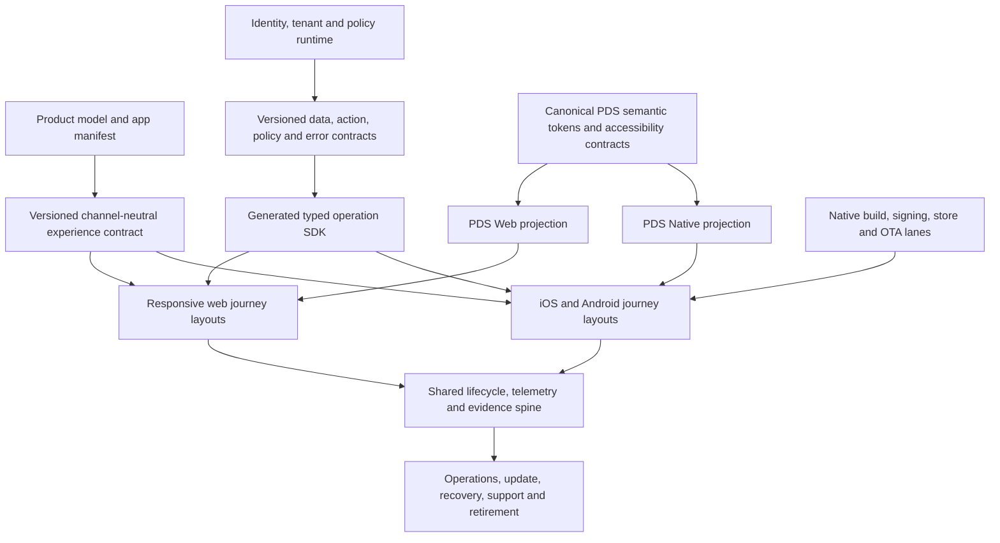

# App Fabric Mobile UX Master Plan

| Field | Value |
| --- | --- |
| Status | task-sponsor accepted operating plan; not roadmap, Product, or Assignment acceptance |
| Spec depth | full |
| Delivery stage | Prototype (pre-candidate) |
| Delivery profile | `accelerated` |
| Maturity | experimental |
| Candidate ready | false |
| Release ready | false |
| Release authority | none |
| Decision date | 2026-08-03 |
| Repository baseline | `origin/main@2de105e001ab8029eb21bce4691eded49e48ff81` |
| Acceptance basis | human direction to formalize this plan and maximize bounded pre-candidate progress |

## Executive Decision

App Fabric will support responsive web and authentic native mobile as two
qualified projections of the same versioned experience contract.

App Framework retains React Native with Expo as its selected reference target,
consistent with the current repository mobile contract. M0-00 treats that
target as the leading, reversible implementation hypothesis to prove against
credible channel and technology comparators. This does not ratify an
enterprise-wide mobile standard or decide that a named business journey needs
an installed app. Responsive web and optional PWA behavior remain important,
but a web layout rendered at a compact breakpoint is not native mobile
evidence.

The PDS Health Design System will expose channel-aware documentation and proof:

```text
Shared experience semantics
|-- Web
|   |-- expanded
|   |-- medium
|   `-- compact
`-- Native
    |-- iOS phone/tablet presets
    `-- Android phone/tablet presets
```

Floorplans, patterns, and components will show semantic parity and intentional
channel differences. Web and native will share purpose, content hierarchy,
action meaning, state vocabulary, identity and policy behavior, accessibility
intent, tokens, telemetry, and resumption semantics. They will not share layout
trees, navigation structures, interaction mechanics, or component
implementations by default.

Pre-candidate delivery will use the repository's existing `accelerated`
profile. Acceleration means focused proof on each changed surface, broad proof
once per assembled integration family, and deferral of candidate, store,
SRA/CAB, and production evidence. It does not relax source-of-truth,
generated-drift, identity, tenant, secrets, dependency, or false-readiness
controls.

## Authority And Decision Boundary

This specification is the implementation master plan for App Framework mobile
capability. The human direction in this task accepts the plan and requests
accelerated pre-candidate progress. The artifact itself does not grant source
or WIP authority: it defines the permitted technical scope once work is
admitted through the Outcome Goal Register, Program Flow Controller, assignment,
worktree, role, branch, and integration contracts.

It does not:

- ratify an enterprise mobile architecture;
- amend the PDS technology strategy or its application contract;
- require every application or journey to have a native client;
- authorize production identity, PHI/ePHI use, app-store publication, MDM
  distribution, accepted risk, funding, SRA/CAB approval, or release;
- make App Fabric a universal portal, workflow engine, system of record, or
  mandatory runtime;
- establish a persona-container or multi-product super-app architecture.

## Relationship To Accepted Fabric Authority

This specification is a subordinate mobile-capability annex, not a parallel
activation program, roadmap, Product Increment, or work ledger. The
[App Fabric Master Implementation Plan](../release/app-fabric-master-implementation-plan.md#numbered-implementation-stages)
provides integrated sequence, effort, dependencies, gates, and proof outcomes;
it is explicitly not live execution or admission authority. The Roadmap
governs priority and posture; the canonical portfolio, validated plans, and
current authorized Program Flow Controller Assignments govern live work,
admission, and WIP.

The [Hosted Product Factory decision provenance](./hosted-product-factory.md#decision-provenance)
and [mobile platform surfaces contract](./hosted-product-factory.md#mobile-platform-surfaces)
make native mobile a first-class *managed platform surface*: registration,
composition, observation, lineage, store-build identity, OTA identity, staged
rollout, adoption skew, and crash health remain platform-qualified. The
[target architecture](../architecture/hosted-product-factory-architecture.md)
defines the intended management-plane design. This plan supplies the
subordinate app-side UX, renderer, generator, identity, build, test, update,
and evidence seams needed to make AF-M05.2 and native-generator graduation
real. It does not advance AF-OG08, revive the deleted dated activation plan, or
authorize Fabric Console/factory work.

Current accepted-main state remains unchanged by this document:

- FAB-A1 is merged and verified, with Product acceptance unrecorded;
- FAB-A2 through FAB-A4 are prepared but not admitted;
- FAB-A5/FAB-A6 and later factory work are not admitted;
- declared mobile surfaces remain read-only observations for the management
  plane until AF-M05.2 seam health and native-generator graduation; and
- D2 must name mobile store, approved build/distribution, and crash/device-
  health authorities before authoritative mobile observation adapters or
  candidate distribution work starts.

M0 planning artifacts may be completed without claiming source admission.
Any executable card still requires its own canonical Product Increment/lane,
exact accepted base, owner, worktree/write roots, review route, and Program
Flow Controller admission.

The app-side profile reuses, rather than renames, FAB-A1 identity and
observation contracts. Only the Fabric registry may mint the durable `app_id`;
the product, App Framework, generator, and local prototype may not self-assign
one. Before registration, planning fixtures keep `app_id:null` and use a
namespaced `prototype_app_ref` whose authority is explicitly
`local-fixture-only`. That provisional reference is not fleet identity, may not
appear in authoritative Fabric observations, and is replaced by a returned
registration cross-reference after `fabric_app_registration@1` succeeds. App
projections map as follows:

| App-side projection | Registration target | Component-snapshot surface |
| --- | --- | --- |
| `web-dom` | `surface:web` | `web` |
| `native-ios` | `surface:native_mobile`, target `ios` | `native_mobile_ios` |
| `native-android` | `surface:native_mobile`, target `android` | `native_mobile_android` |

Signed store/OTA identity, store release, version adoption/skew, crash-free
rate, and store-rating facts remain source-attributed through
`app_component_snapshot@1` and `fabric_observation_event@1`. The Prototype
profile records registration as pending, carries no durable `app_id`, and
cannot emit authoritative fleet observations. D2 must name the store-console,
build/distribution, and
crash/device-health authorities before candidate or observation-adapter work.

The durable continuation entry point is the
[Mobile Operating Context](../start/app-fabric-mobile-operating-context.md).
Its [M0 Seam-Freeze Record](./app-fabric-mobile-m0-seam-freeze.md) indexes the
[Technology Evaluation Brief](./app-fabric-mobile-technology-evaluation-brief.md),
[experience contract schema](./app-fabric-experience-contract.schema.json),
[renderer ADR](../architecture/adr/0017-web-native-experience-projection-boundary.md),
[API seam](./app-fabric-mobile-api-seam.md),
[mobile manifest planning profile](./app-fabric-mobile-manifest-profile.schema.json),
[mobile auth planning profile](./app-fabric-mobile-auth-profile.schema.json),
and [build-custody record](./app-fabric-mobile-build-custody-decision.md).

The consulted `pds-technology-strategy` snapshot was at
`046e532c0e41b6911171f3d9aa961c0898d66140`.

| Source Binding | Authority And Status At Consultation | Version / As Of | Use Here |
| --- | --- | --- | --- |
| `doc.enterprise_technology_strategy_2026_2030` | governing authority class; draft, not ratified | `2026-07-31-draft.3`; evidence as of 2026-07-31 | governing evaluation requirements at the bound draft |
| `contract.application` | machine contract; `draft_for_eac_ratification`; recommendation only and confers no approval | `2026-07-31-draft.3`; evidence as of 2026-07-31 | Explore-stage fields, progressive proof and regression expectations |
| `doc.application_fabric_strategic_direction` | draft companion with no governing effect | `2026-08-01-draft.2` | pending candidate input for one lifecycle/evidence spine and multiple qualified lanes |
| `review.slice-mobile-2026-08` | evidence only; corrected review, unapproved defaults | `2026-08-01-evidence.2`; reviewed 2026-08-01 | technical challenge, mobile concerns and missing evidence |
| `decision-packet.mobile-channel-and-installed-application-posture` | operating/release-excluded packet; pending major decision; no governing effect | unversioned packet bound to the consulted commit; status pending | pending candidate design input, never current policy |
| `gate.application-fabric-strategic-direction` | open | consulted 2026-08-03 | prevents this plan from claiming strategy adoption |
| `gate.strategy-enterprise-architecture-interface` | open | consulted 2026-08-03 | prevents the reference profile from claiming EAC architecture approval |

Before candidate entry, refresh the BOK source binding and revalidate external
platform, legal, security, accessibility, and store assumptions.

## Owners And Decision Rights

| Role | Owns In This Program | Does Not Own |
| --- | --- | --- |
| Business outcome owner / Product Owner — durable name TBD before reference-journey acceptance | named proof journey, outcome, priority and acceptance | architecture details, risk acceptance by implication |
| Fabric Architect | coherence of the complete Fabric plane, shared seams, architecture sequence, proof strategy, compatibility model | strategy ratification, product priority, release or risk approval |
| Mobile Architect | native reference profile, shell, native behavior, device/runtime boundaries, mobile implementation slices | web or PDS semantic authority, enterprise architecture ratification |
| PDS Design System Owner | canonical App Framework/PDS implementation tokens, renderer contracts, accessibility intent and catalog governance | enterprise UX/accessibility-standard authority, product journey ownership, app runtime policy |
| Runtime/Identity Owners | API, policy, tenant, token validation, session and audit contracts | client-side authorization as an authority |
| Finance/contract owner — TBD before candidate entry | comparison method, three-to-five-year lifecycle economics, cost per successful outcome and material contract boundary | product or architecture approval |
| Persistent operating/support owner — TBD before external preview distribution | service health, support, incident, update, compatibility, recovery and retirement model | release or accepted-risk authority |
| Business-service owner — TBD when the reference journey touches a material service | service outcome, process/source authority and adoption/support obligations | Fabric architecture or channel selection by implication |
| Integration Branch Manager | seam freeze SHA, merge order, assembled-family proof, integration PR evidence | product priority, architecture or release authority |
| Program Flow Controller | WIP admission and queue movement under the ratified operating model | product, source, merge, architecture, risk, or release authority |
| Security, Privacy, Data, Legal, Continuity, EAC, SRA/CAB, Release authorities | applicable candidate and production decisions | automatic approval through generated defaults or local evidence |

When roles disagree, the Fabric Architect resolves technical coherence only.
Product value routes to the Product Owner; architecture ratification routes to
EAC; security or privacy risk routes to the relevant human authority; WIP
routes to the Program Flow Controller; merge order routes to Integration. TBD
owners are evidence gaps with the stated last safe lifecycle stage, not roles
silently inherited by the Architect or Product Owner.

## Business Value

The mobile capability exists to improve complete, named journeys in contexts
where installation, touch, interruption and resumption, push, secure local
custody, offline/degraded behavior, camera/file access, or device lifecycle
materially improve the outcome.

The Fabric investment is successful when it:

- lets product teams deliver appropriate web and native experiences from the
  same governed intent without forcing pixel or component-tree parity;
- preserves authoritative SaaS, clinical, data, and workflow systems behind
  typed and versioned contracts;
- makes safe identity, policy, accessibility, telemetry, update, and support
  behavior the paved path;
- reduces normalized lead time, upgrade effort, lifecycle cost, and defect risk
  on independent second and third uses;
- enables intentional channel quality without building a generic CRUD portal
  or duplicating enterprise authorities.

Feature count, generated screen count, static scaffold checks, and the number
of applications are not outcome evidence.

## Problem Statement And Current Baseline

The repository has a sound direction document and a first generated React
Native/Expo scaffold, but it does not yet have an integrated mobile product
capability. The current evidence must continue to say `release_ready:false`.

| Surface | Current Baseline | Consequence |
| --- | --- | --- |
| Mobile decision | `docs/frontend/mobile-react-native.md` selects React Native + Expo and separates shared intent from channel layout | direction exists, enterprise qualification does not |
| Topology | the target mobile manifest contract is documented but is not yet the canonical app-manifest schema | mobile is not a first-class declared application surface |
| Generator | mobile emission is embedded as Python in `scripts/appfw`; it regex-parses generated web TypeScript and reads prior generated mobile output for some defaults | fragile source ordering, circularity, product residue, and unclear ownership |
| API client | the generated client requests Relay-like `nodes/pageInfo/totalCount`; the generated backend returns App Framework `items/query_count/next_cursor` shapes, and fallback identifier typing can differ | static tests can pass while real client/server execution fails |
| Product UI | generated entity shells and a token bridge exist; product-owned native workflow, endpoint, auth, lifecycle, and real device evidence do not | a scaffold is not a usable product journey |
| Design System | the web catalog can render compact previews, but there is no governed React Native library or native catalog mode | responsive-web proof can be mistaken for native proof |
| Identity | mobile AuthSession/SecureStore guidance exists; native public-client sign-in, session renewal, logout, deep-link return, and multi-audience server validation are not integrated | authentication and server compatibility are unproved |
| Build/test | static and local checks exist; dual-platform build, simulator/emulator journey, device, and store evidence remain absent or placeholders | neither candidate nor release readiness is established |
| Updates/operations | EAS lanes and binary-versus-OTA guidance are documented | compatibility, signing custody, rollout, recovery, support, and telemetry are not yet implemented |
| Evidence integrity | the verifier distinguishes scaffold from release readiness, but retained evidence can still be local, stale, bypassed, or single-platform | every readiness decision needs exact source/config/build binding |
| Catalog projection | floorplans currently carry a free-text adaptation description and a separate native-mobile example rather than executable web/iOS/Android projections | the catalog cannot yet prove renderer parity or native maturity |

The first implementation objective is therefore not “generate more mobile
screens.” It is to make one representative cross-channel journey execute from
the shared contract through responsive web and the real native shell, identity
boundary, typed server contract, PDS projections, telemetry, correlation, and
interruption/resumption path.

## World-Class Outcome

A world-class App Fabric mobile capability has all of these properties:

1. **Journey quality.** Each channel is selected because it improves a named
   outcome for a named user in representative conditions.
2. **Native authenticity.** The installed app uses expected navigation, touch,
   back behavior, safe areas, keyboard handling, deep links, lifecycle,
   notifications, device APIs, and distribution conventions.
3. **Semantic coherence.** Web and native present the same purpose, governing
   policy, action meaning, provenance, status, and recovery semantics without
   requiring identical layouts.
4. **Inclusive use.** VoiceOver, TalkBack, keyboard/switch behavior where
   applicable, text scaling, contrast, reduced motion, focus, readable order,
   target size, orientation, and error recovery are designed and tested.
5. **Trust by construction.** Native public-client identity, least privilege,
   tenant isolation, token custody, data minimization, secure logging,
   dependency integrity, and fail-closed policy behavior are default paths.
6. **Resilience.** Loading, empty, stale, partial, offline, denied, expired
   session, interrupted, conflict, retry, and unexpected-error states are part
   of the contract rather than product-specific afterthoughts.
7. **Performance discipline.** Startup, responsiveness, memory, network,
   battery, list rendering, image, animation, and bundle behavior are measured
   against journey-specific budgets on representative devices.
8. **Operability.** Build identity, runtime compatibility, telemetry,
   correlation, support diagnostics, update rings, recovery, deprecation, and
   retirement are traceable.
9. **Repeatability.** A second and third independent product team reuse the
   capability with lower normalized lead time and lifecycle cost and without
   increased risk or channel-quality loss.

Targets that require product baselines, representative populations, finance
inputs, or human risk decisions remain named fields. This plan does not invent
them.

## Explore-Stage Options Record

M0-00 will retain a focused Technology Evaluation Brief before the reference
profile hardens beyond a reversible experiment. The current disposition is:

| Credible Path | Best Fit | Current Disposition |
| --- | --- | --- |
| responsive web and optional PWA only | journeys that need broad reach but not installed/native capability | required web baseline and valid final selection; not native proof |
| React Native with Expo | shared TypeScript/product-engineering leverage plus authentic iOS/Android behavior and managed build/update tooling | leading bounded reference hypothesis |
| platform-native Swift and Kotlin | journeys whose safety, performance, hardware, accessibility or platform depth materially exceeds cross-platform economics | credible alternative; not first reference implementation |
| another cross-platform native path | where its lifecycle, support, security, performance or staffing evidence materially exceeds the leading hypothesis | comparison required at M0-00; no generic exclusion by brand |
| vendor-native experience plus typed integration/deep link | authoritative vendor journey already meets the outcome and control need | prefer over duplicate PDS UI when adequate |
| standalone product binary | clear product/service ownership and independent lifecycle | default reference packaging hypothesis |
| shared shell or multi-product container | several journeys genuinely benefit from shared installed lifecycle and its operating economics | separate architecture decision; not preapproved |
| defer or no installed app | native channel adds insufficient outcome value or creates disproportionate lifecycle risk | always-valid outcome |

The brief records the named journey hypothesis, comparator, capability needs,
architecture and staffing fit, accessibility/security/performance implications,
three-to-five-year lifecycle and support considerations, reversibility, cost
ceiling, stop triggers, and evidence gaps. React Native + Expo remains selected
only for bounded reference proof when it is the best current reversible path.
Re-evaluate if it cannot meet representative accessibility, security,
performance, offline/device, upgrade or support needs without excessive native
exceptions, dependency exposure or duplicate platform work.

The reference journey proves App Framework platform behavior only. It does not
select a channel, stack, risk posture or business case for a real patient or
team-member journey. Each such journey needs its own proposal identifier,
named outcome and service owners, Explore/Technology Evaluation Brief,
comparator and channel disposition. Reusable component evidence may be cited;
the journey decision does not transfer between populations or products.

## Architecture Principles

1. **Journey before channel.** Select web, native, or both from outcome and
   context, not from a platform quota.
2. **Shared intent, separate projections.** Share contracts and semantics; let
   each channel own its layout and behavior.
3. **Semantic parity, not pixel parity.** Equivalent outcome and control matter
   more than identical information density or navigation.
4. **One lifecycle spine, multiple qualified lanes.** Mobile uses the same
   formation, evidence, policy, compatibility, and support spine while keeping
   channel-specific build and proof.
5. **Authority preservation.** The Fabric composes journeys across typed seams;
   it does not recreate authoritative platforms.
6. **Canonical input only.** Generate web and native from normalized product and
   experience contracts, never by parsing one channel's generated output.
7. **Small generated waist.** Generate deterministic contracts, clients,
   registries, adapters, and safe shells. Keep journey composition and native
   behavior product-owned.
8. **Qualified opt-in.** Mobile is a manifest-declared capability, not an output
   silently emitted for every product.
9. **Security and accessibility in the paved path.** Their design cannot be
   deferred even when managed certification evidence is deferred.
10. **Defaults accelerate proof, not approval.** A generated or inherited
    default never confers architecture, compliance, security, accessibility,
    candidate, or release status.
11. **Compatibility before convenience.** API, mobile contract, binary runtime,
    OTA update, persisted data, and backend change compatibility are explicit.
12. **Prove reuse.** Platform scale follows independent second and third uses,
    not the first successful reference app.

## Target Fabric Architecture



### Established Fabric Plane Map

The canonical App Fabric **management-plane surfaces** remain the four named
in the Enterprise App Fabric strategy: Fleet registry, Per-application
workspace, Hosted Product Factory, and Product/runtime plane. This mobile plan
does not rename, replace, or add to those management surfaces.

Within an application's web/native experience and production spine, retain
the following seven **implementation concerns**. They are authority and
capability boundaries, not additional enterprise planes and not a requirement
to deploy seven services:

| Application/experience concern | Mobile/Web Responsibility |
| --- | --- |
| Experience | experience contract, renderer projections, PDS semantics, floorplans, patterns, attention and exact resumption; never source authorization |
| Data and event | authoritative reads, justified projections, lineage, freshness, cache/offline policy and event participation only when earned |
| Source capability and action | typed named operations, preview/confirmation, idempotency, audit, receipt and reconciliation; never client-selected arbitrary endpoints or alternate mobile writes |
| Identity and permission | browser/native identity profiles, verified resource-server tokens, tenant/policy enforcement and source authorization |
| Intelligence | structured provider-neutral results, evidence, freshness, limitations and deterministic fallback; actions return through the governed action plane |
| Measurement and operations | request/correlation continuity, outcomes, native crash/performance, compatibility, build/update health, support and recovery |
| Governance | source-bound proof, generated drift, security evidence, Prototype limitations and explicit candidate/release transitions |

The application-production spine compiles these concerns into channel
artifacts. The implementation subsystems below refine responsibility within
that spine; they do not introduce additional enterprise planes or compete with
the four management-plane surfaces.

### Implementation Spine Responsibilities

| Plane | Durable Contract | Primary Owner |
| --- | --- | --- |
| Product formation | manifest capability, product model, journey references, classifications | product model/manifest owners with Fabric Architect seam review |
| Experience | task, action, state, provenance, resumption, telemetry, accessibility and channel hints | Fabric Architect; product owns journey content |
| Design System | semantic tokens, component/pattern/floorplan contracts, platform projections and catalog proof | PDS Design System Owner |
| Generation | normalized intermediate representation, deterministic emitters, ownership map and drift checks | App Framework generator owner |
| Web channel | responsive layouts, browser navigation, DOM semantics, PWA/browser behavior | web product/framework owners |
| Native channel | shell, native navigation, touch, device/lifecycle integration, iOS/Android projections | Mobile Architect and product mobile owner |
| Runtime | typed APIs/actions, policy, tenant, errors, audit, correlation and compatibility | Runtime/API owners |
| Identity/trust | OIDC client profiles, token validation, session lifecycle, local custody and data policy | Identity/Security owners |
| Delivery | reproducible builds, signing, update channels, stores/MDM, provenance and recovery | Mobile platform/release owners |
| Evidence/operations | source-bound proof, telemetry, SLOs, support, incident, upgrade and retirement | Fabric operations with product service owner |

The Fabric Architect owns coherence across the seven planes and their
implementation spine. This does not mean that the Architect implements every
subsystem or assumes the authority of its product, PDS, security, EAC,
integration, or release owner.

## Versioned Experience Contract

The normalized contract is the common waist between product intent and channel
projection. It must be derived from canonical model and product-owned
experience inputs, serialized as machine-readable data, versioned, validated,
and consumable without parsing TypeScript or another generated channel.

The target product-owned authoring root is
`.appfw/specs/experience/<contract-id>.json` (or an equivalent validated format
selected by M1). It references `.appfw/model`, the app manifest, API contract,
and PDS contract; it does not duplicate those authorities. The M0 JSON example
in this repository is a synthetic schema fixture, not product truth. M1 must
load the authoring source explicitly into normalized in-memory IR and emit web
and native projections from that IR. Existing
`frontend/src/generated/appfw-ui-contract.ts`, prior generated mobile files,
and retained target reports are migration evidence and outputs only; they are
never parsed to recover authoring intent.

Minimum concepts:

- stable journey, task, view, action, field, state, and telemetry identifiers;
- persona/role and channel applicability;
- content hierarchy and criticality, without fixed coordinates;
- typed reads, governed actions, validation, policy, tenant, provenance, audit,
  and correlation semantics;
- loading, empty, partial, stale, offline, denied, expired, conflict, success,
  and unexpected-error states;
- interruption, checkpoint, exact-resumption, deep-link, and notification intent;
- data classification, local-persistence eligibility, redaction, screenshot,
  clipboard/share, notification, and cache constraints;
- accessibility name, role, state, value, order, announcement, text-scale, motion,
  contrast, and alternate-interaction intent;
- channel-neutral design semantics and optional channel hints;
- API and contract compatibility range;
- evidence hooks and support diagnostics.

The contract may express that a task benefits from a bottom tab, bulk action,
camera, biometric confirmation, split view, or dense comparison, but the web
and native renderers decide how that intent becomes a platform-appropriate
layout. It must not encode a DOM tree and relabel it as mobile.

### Generation Boundary

Move mobile generation from embedded shell/Python orchestration into the
framework generator and use a normalized intermediate representation shared by
web and mobile emitters.

Generated and overwrite-safe targets should include:

- the validated experience and mobile capability contract;
- typed operation SDK and response/error models generated from the actual
  schema/operation contract;
- route and action registries;
- PDS Native semantic token adapter;
- capability/config schemas and ownership metadata;
- safe screen or recipe shells where deterministic generation adds value;
- drift, compatibility, and evidence manifests.

Product-owned and preserved targets should include:

- native journey composition and product-specific navigation;
- channel-specific information architecture and copy;
- product composites and device integrations;
- offline policy and conflict handling within governed constraints;
- notification handlers, deep-link destinations, store content, and product
  tests.

The generator must not:

- parse `frontend/src/generated/*.ts` as canonical input;
- read a previous generated mobile file to recover product decisions;
- contain CRM/entity-specific fallbacks in framework source;
- fabricate GraphQL pagination, variable, identifier, or response shapes;
- overwrite human-owned workflow code;
- claim product quality from route-shell quantity.

## Web And Native UX Contract

Breakpoints are sufficient for responsive web when the task, interaction,
security posture, lifecycle, and browser capabilities remain appropriate. They
are not a method for converting a browser application into an authentic native
application.

| Concern | Responsive Web | Native Mobile |
| --- | --- | --- |
| Layout | CSS/container queries, expanded/medium/compact compositions | native layout, safe areas, orientation and the same canonical size classes |
| Navigation | URL routes, sidebar/header, browser back, tabs where appropriate | stacks, tabs, sheets, modals, native back, universal/app links |
| Interaction | pointer, keyboard, touch, browser focus and hover | touch, gestures, haptics, keyboard avoidance, OS controls |
| Density | tables, split panels and bulk action where usable | prioritized cards/lists, drill-in, progressive disclosure, action sheets |
| Lifecycle | page/tab visibility, browser storage and network | foreground/background, process death, state restoration, OS interruptions |
| Device | web capabilities with permission and fallback | push, biometrics, camera, files, share, secure storage and platform permissions |
| Distribution | web deploy/cache/PWA update | signed binary, store/MDM, runtime channel and OTA compatibility |
| Accessibility | semantic DOM and browser/AT combinations | native semantics and VoiceOver/TalkBack/platform combinations |

Every named journey must record one of these dispositions:

- `web-only`;
- `responsive-web`, including compact-browser proof;
- `native-only` because channel capability is essential;
- `web-and-native` with explicit shared semantics and intentional differences;
- `not-yet-qualified` when evidence is insufficient.

## PDS Design System Channel Model

Yes: the Design System catalog must show web versus native modes for
floorplans, patterns, and components. A single “mobile” viewport toggle is not
enough because it proves only browser containment.

This is the App Framework/PDS implementation catalog. It supplies candidate
evidence for a future enterprise UX/accessibility standard but does not confer
that standard's authority; EAC or its recorded delegate owns that decision.

### Renderer Projection Is Not A Theme

Extend the accepted PDS dimension model with an explicit, non-appearance
`renderer projection` dimension:

```text
renderer projection
|-- web-dom
|-- native-ios
`-- native-android

canonical size class
|-- compact
|-- medium
`-- expanded
```

`renderer projection × size class` is the canonical schema. Projection already
encodes the native platform, so there is no independent `native platform` axis
that could form invalid `native-ios × android` combinations. Named catalog
presets such as `iOS phone`, `iOS tablet`, `Android phone`, and `Android tablet`
select a valid projection, size class, OS/device evidence target and input
environment; they do not introduce another semantic dimension.

Appearance remains orthogonal: visual grammar, color mode, density where
applicable, and accessibility environment. Native iOS and Android are not a
third visual theme. Record this clarification in a focused follow-up ADR,
provisionally “ADR 0017: Web/Native Experience Projection Boundary.” Also
clarify that the existing requirement for identical DOM semantics and keyboard
behavior applies across web appearance/adaptation combinations; cross-renderer
parity requires equivalent semantic role, state, outcome, authorization and
accessibility intent using each renderer's native semantics.

### Catalog Axes

The catalog must support these independent axes where applicable:

- renderer projection: `web-dom`, `native-ios`, or `native-android`;
- canonical size class: `compact`, `medium`, or `expanded`, constrained by the
  selected projection and evidence target;
- color mode: `system`, `light`, or `dark`;
- forced-colors/high-contrast environment posture, separate from color mode;
- text scale and dynamic type;
- reduced motion and reduced transparency where supported;
- direction and localization stress;
- connectivity/state: online, degraded, offline, stale, denied, expired;
- policy/data state: redacted, sensitive, unavailable, destructive or governed
  action;
- input/assistive technology: touch, keyboard/switch where applicable,
  VoiceOver/TalkBack.

### Catalog Content By Level

| Level | Shared Documentation | Channel Proof |
| --- | --- | --- |
| Semantic token | purpose, allowed use, contrast/state intent | CSS/web mapping and React Native/iOS/Android mapping |
| Component | role, anatomy, content, states, accessibility and telemetry | separate web and native implementations with platform variants |
| Pattern | task intent, sequencing, errors, interruption and policy behavior | web and native compositions, including intentional differences |
| Floorplan | information architecture, priority, regions, resumption and outcome | every qualified projection/size class, with explicit `not-applicable` or `not-qualified` elsewhere |
| Journey recipe | end-to-end state/action/provenance contract | runnable reference routes on web and native where qualified |

Each entry must display:

- one availability/applicability map across all projections so shared semantics
  and several renderers can be supported simultaneously; values are
  `supported`, `adapted`, `product-specific`, or `not-applicable`;
- the existing family maturity axis: `foundation`, `enterprise-ready`, or
  `release-gated`;
- the existing component lifecycle axis: `experimental`, `beta`, `stable`, or
  `deprecated`;
- a separate per-projection readiness map with `prototype`, `candidate`,
  `qualified`, `not-qualified`, or `not-applicable`;
- source package and owner;
- supported states and accessibility contract;
- known platform differences and fallback;
- evidence freshness and exact package/source version;
- migration and compatibility notes.

The catalog should offer side-by-side semantic comparison. It should not place
a web component inside a phone-shaped frame and label that a native component.
The web portal may display retained native images, recordings and evidence, but
React Native rendered through a web target is still not iOS/Android proof.
Use one shared catalog manifest with two executable renderers: the actual React
DOM Web Catalog and an actual React Native Catalog run on iOS and Android.
Initially prove only the selected reference floorplan family across its
qualified projections; do not mechanically project every floorplan to every
channel.

### Package Shape

Converge toward channel packages over canonical semantic sources:

```text
@pds/design-tokens          canonical semantic token data
@pds/web                    DOM/CSS implementation
@pds/native                 React Native implementation
@pds/experience-contracts   shared state, action and accessibility semantics
@pds/catalog                web/native documentation and evidence adapters
```

Package boundaries are a target architecture, not a mandate to publish five
packages immediately. The first slice may keep them in one workspace if source
ownership and imports preserve the boundaries.

## Native Application Architecture

### App Shell

The reference shell supplies platform services, not product navigation policy:

- Expo Router root, authenticated and unauthenticated route groups;
- identity/session provider and explicit tenant context;
- typed API/operation provider;
- PDS Native theme, dynamic type, motion, locale and accessibility providers;
- safe-area, keyboard, network and app-lifecycle adapters;
- deep-link and notification routing registry;
- error boundary, correlation/support surface and telemetry adapter;
- secure storage abstraction with data-class restrictions;
- update compatibility and mandatory/optional update state;
- product-owned journey route composition.

Do not make a shared shell a universal persona container. Whether multiple
products share a binary, bundle identifier, navigation root, identity session,
or update cadence requires a separate architecture and operating-cost decision.

### State And Data

- Keep server authority and policy decisions on the server.
- Use generated typed operations from real API schema/contract sources.
- Separate remote server state, local UI state, durable preference state, and
  explicitly approved offline data.
- Default sensitive business and clinical data to memory-only, no offline
  persistence.
- Gate offline persistence by classification, retention, encryption, deletion,
  device loss, re-authentication, conflict, audit, and support decisions.
- Include request and correlation identifiers in error/support flows without
  logging tokens, sensitive payloads, or tenant data.
- Model cache invalidation, schema changes, account/tenant switch, logout, remote
  revocation, and app reinstall explicitly.

### Authentication And Server Trust

The installed app is an OAuth/OIDC public client:

- Authorization Code with PKCE and system-browser authentication;
- no embedded client secret;
- exact redirect/universal/app-link allowlists; native private-use schemes are
  reverse-domain based with single-slash paths, or use platform-claimed HTTPS;
- state, nonce, issuer, audience, signature, expiry and authorized-party/client
  validation as required by the IdP contract;
- access tokens remain in memory by default; only IdP-approved renewal
  material may use OS-backed persistent custody;
- explicit renewal, rotation, logout, revocation, tenant switch, device loss,
  clock skew, background expiry, and cancelled-login behavior;
- step-up or biometric confirmation only when justified by the action and threat
  model; biometrics do not replace server authorization.

The server must support separately registered browser and native client
profiles rather than assuming one confidential-browser client identifier is
the universal audience. Configure an allowlisted issuer/audience/client profile
set with explicit platform, environment, exact redirect ownership, and distinct
browser/iOS/Android profile identities. Cache and refresh JWK material with
bounded staleness and key-rotation behavior; do not fetch the discovery/JWK
path afresh for every request.

The local issuer remains byte-for-byte identical across discovery, tokens,
clients, and the resource server and uses HTTPS with normal certificate
validation. The Prototype installs an explicit development CA; it never
disables TLS validation, and the issuer certificate includes the
`127.0.0.1` IP subject-alternative name. iOS Simulator may use host loopback. Android Emulator
uses a pinned `adb reverse tcp:4455 tcp:4455` bridge for the same
`https://127.0.0.1:4455/oidc` issuer; substituting `10.0.2.2` only in the client
would change `iss` and is prohibited. Physical-device issuer reachability is
outside the M0 local profile and needs its own secure, authorized endpoint.

M4a proof must run through the actual signature/issuer/audience/client verifier
with every local/test authentication bypass disabled and its effective
environment/security flags retained. Accepted-main currently grants a local
admin identity for missing or arbitrary bearer input under the local runtime
posture; that path is explicitly invalid as mobile auth evidence. The audited
client/profile identity must come from the token and the validated allowlisted
profile, not be copied from one configured default client after validation.
The local profile resolves only the access token's `azp` claim, requires an
exact client-ID/profile match, rejects missing or conflicting attribution, and
rejects an ID token presented as an API bearer. A different IdP claim mapping
requires an explicit versioned profile rather than fallback precedence.
The local access token's audience and scope set must exactly match its declared
profile; missing or unregistered/excessive scopes fail closed.
The Prototype machine contract is
[`app_fabric_mobile_auth_profile@1`](./app-fabric-mobile-auth-profile.schema.json).
Its local issuer and native redirect rules follow
[RFC 8414](https://www.rfc-editor.org/rfc/rfc8414.html#section-2) and
[RFC 8252](https://www.rfc-editor.org/rfc/rfc8252.html#section-7.1); exact
registration and public-client handling follow RFC 8252 section 8.4.

Negative contract tests are required from the first auth implementation:

- wrong issuer, audience, client/authorized party, algorithm or signature;
- missing, malformed or conflicting `azp` client attribution and ID-token
  substitution at the API;
- missing or excessive/unregistered scopes;
- expired/not-yet-valid token and excessive clock skew;
- missing/invalid tenant, role or policy claims;
- cross-tenant identifier and cache reuse;
- revoked/rotated key and discovery outage;
- missing/mismatched state, applicable nonce mismatch, missing/wrong PKCE
  verifier, `plain` downgrade, redirect mismatch, authorization-code replay,
  cross-client token substitution, cancelled login and renewal failure;
- logout/account switch with local state removal.

Universal certificate pinning is not a default. Make transport hardening a
risk-tiered ADR that considers platform guidance, managed TLS interception,
certificate/key rotation, compromise recovery, offline behavior, and the
specific threat model.

### Mobile-Specific Security Work

Threat-model at least:

- public-client impersonation, redirect hijacking and token theft;
- rooted/jailbroken or shared devices and device backup/restore;
- sensitive data in local storage, logs, crash reports, screenshots, clipboard,
  share sheets, notifications, caches and app switcher snapshots;
- deep-link and push spoofing, replay and unauthorized route disclosure;
- offline tampering, stale authorization and synchronization conflicts;
- third-party native modules, compromised packages and build dependencies;
- signing credentials, store accounts, provisioning, CI runners and OTA keys;
- malicious or incompatible OTA update and recovery/downgrade behavior;
- debug features, developer menus, proxying and production configuration drift;
- excessive permissions, background access and platform privacy declarations.

Candidate proof executes controls, not only threat-model prose. It must cover
OS secure-storage backup/reinstall and logout/account-switch deletion,
app-switcher snapshots, screenshot/clipboard/share policy, crash and telemetry
scrubbing, opaque notification references resolved only after fresh server
authorization, deep-link/push replay rejection, and compromised dependency,
builder, signing, or update recovery.

Accelerated work may use synthetic data, a standards-conformant local/synthetic
issuer and development signing on bounded devices. Enterprise IdP/application
registration is a candidate tripwire. Prototype work may not use production
credentials, PHI/ePHI, tenant data, or a security bypass to complete a
demonstration.

## Performance And Reliability

Performance budgets belong to representative journeys and devices. During
pre-candidate work, collect baselines and expose regressions; Product and the
Mobile Architect set numeric targets before candidate entry.

Measure:

- cold and warm launch to first usable task;
- sign-in/renewal and first authorized data latency;
- route transition and input responsiveness;
- long-list scroll, memory and render stability;
- bundle, native binary and update payload size;
- API request count, payload, cache hit and retry behavior;
- image decode/cache behavior;
- background/foreground resume and process-death recovery;
- offline transition and resynchronization;
- battery, CPU, network and memory on representative low/median/high devices;
- crash-free and handled-error sessions once candidate telemetry exists.

Implementation defaults:

- measure before introducing memoization or native modules;
- virtualize long collections and avoid nested unbounded scrolling;
- keep work off the JavaScript/UI critical path;
- paginate and bound payloads at the API contract;
- use platform-native animations with reduced-motion behavior;
- prevent telemetry, retry and polling loops from becoming battery/network
  drains;
- keep native modules few, justified, pinned, and directly build-tested.

## Development Environment

The local developer loop should include an emulator or simulator. It is the
fastest credible way to prove layout, navigation, keyboard, lifecycle, deep
links, auth redirect, API reachability, and platform configuration.

The standard environment is:

- pinned Node/package manager, Expo SDK, React Native and native dependency
  compatibility set;
- deterministic lockfile and `npm ci` or the chosen locked equivalent;
- Expo development build rather than Expo Go for product proof;
- iOS Simulator on macOS/Xcode where available;
- Android Emulator from the pinned Android SDK/AVD baseline;
- synthetic local backend/IdP fixtures for fast tests plus an integration
  environment for real contract/auth proof;
- platform-aware API endpoints (`localhost`, Android emulator host mapping, or a
  secure reachable endpoint) generated from environment profiles;
- a `mobile doctor` command that detects tools and reports capability without
  mutating product model source.

Do not require every contributor to run both native toolchains for every leaf.
Require the affected platform locally when the behavior cannot be proved at the
JS/component layer, and let the assembled integration lane prove both
platforms. Physical devices remain necessary for hardware, real networking,
background, push, biometric, MDM, and release-significant behavior.

## Build, Test, Evaluation, Distribution And Updates

### Test Pyramid

| Layer | Pre-Candidate Purpose | Candidate Expansion |
| --- | --- | --- |
| Contract/schema | exact operation, state, auth, tenant and error compatibility | provider/environment matrix and compatibility history |
| Unit | reducers, transforms, validation, policy presentation, compatibility logic | coverage/risk thresholds |
| Component | PDS semantics, states, text scale, focus/announcement and interaction | platform/AT matrix |
| Route/integration | providers, navigation, deep links, session and real API client | full representative environment matrix |
| Simulator/emulator E2E | critical journey on iOS and Android, degraded and denied paths | release-mode, OS/device range, sustained runs |
| Physical device | capabilities that cannot be simulated credibly | formal device and MDM matrix |
| Preprod/UAT | named users, representative data/conditions and operational support | acceptance authority and production-like resilience |
| Store/distribution | signed build, metadata, track, compatibility and recovery | review/MDM approval and rollout evidence |

Mocks can prove local client behavior. They cannot prove API, auth, tenant,
device, store, or managed-security integration.

### Preproduction Evaluation

Before candidate promotion, define a proof card with:

- named journey and accountable outcome owner;
- user/persona, channel rationale and representative conditions;
- current comparator and baseline, including a credible non-Fabric option;
- hypothesis and success/failure measures;
- cost ceiling, blast radius, stop rule and rollback;
- evidence owner, support owner and next decision trigger;
- missing legal, privacy, accessibility, security, continuity, finance, EAC,
  store, MDM, or release decisions.

Candidate evaluation must use a real backend and non-production identity
integration. It must exercise happy, denied, invalid, expired, interrupted,
offline/degraded, resume, update and recovery paths on both required platforms.

### Distribution Lanes

| Lane | Audience | Evidence Level |
| --- | --- | --- |
| development | developers on simulator/emulator/device | local source-bound proof; never release evidence |
| preview | QA/design/accessibility/product reviewers | internal signed build and representative journey proof |
| production-candidate | TestFlight, Play internal/closed or approved enterprise equivalent | candidate build, store/MDM metadata and promotion evidence |
| production | approved store/managed rollout rings | full release authority, monitoring, recovery and support evidence |

Bundle/package identifiers, store accounts, certificates, keys, provisioning,
signing and submit roles must be organization-owned with least privilege and
recovery procedures before candidate distribution.

M0 must park an explicit build-custody decision: whether application source,
dependency metadata, signing requests and/or signing material may enter EAS
Cloud, or whether builds/signing must stay on enterprise or self-hosted runners.
The decision evaluates data egress, secret custody, tenant isolation, logs,
provenance, vendor contract, availability, recovery, revocation and exit. It is
not required to begin local development builds, but its approved disposition is
an M8/candidate prerequisite.

### Update Model

Treat binary, OTA, API and persisted-data compatibility separately:

- native code, SDK, entitlement, permission, privacy manifest or native
  dependency changes require a new signed binary;
- compatible JavaScript, style and asset changes may use OTA only within the
  declared runtime range and platform/store policy;
- every update has a source SHA, dependency/config hashes, build/runtime ID,
  channel, provenance, rollout ring, health signal, stop condition and recovery
  action;
- prevent an OTA from crossing incompatible native module, schema, policy,
  security, or minimum-backend boundaries;
- support forced, recommended and background-compatible update UX without
  trapping a user in an unresumable governed action;
- retain a server compatibility window and explicit retirement policy for old
  client versions;
- OTA recovery means halt rollout and issue a source-bound forward fix, or use
  an embedded-bundle fallback only where that exact mechanism is implemented
  and proved. Native-binary recovery uses store/MDM halt, staged replacement,
  and, where the authority supports it, rollback to an approved build. Neither
  mechanism can atomically recall bytes from offline devices, so the backend
  must preserve a skew-aware compatibility window and safe unsupported-client
  response;
- prove non-production rollout halt, recovery, and old/new-version coexistence
  before candidate entry; prove production custody and rollout authority later.

## Workstreams

| ID | Workstream | Primary Output | Depends On | Exit |
| --- | --- | --- | --- | --- |
| M0 | Explore, architecture and seam freeze | M0-00 options record; versioned experience, manifest, API/auth, PDS and evidence seams; parked build-custody decision | this master plan | Fabric Architect/Integration freeze SHA, routed owners and provisional boundaries recorded |
| M0c | Legacy readiness containment | prevent the existing static/mobile-test path from producing an authoritative `release_ready:true` until the source-bound mobile candidate checker exists | accepted planning baseline and current legacy verifier | candidate/release readiness is forced false, explicitly non-authoritative, and adversarially regression tested |
| M1 | Formation and generator | mobile manifest capability, normalized IR, deterministic `app_gen` emitters and ownership/drift proof | M0 | fresh downstream generation consumes no web/generated mobile source |
| M2 | PDS Native and catalog | semantic token projection, minimum native primitives, one shared manifest, actual Web/React Native catalogs and the reference floorplan family | M0 | source-bound Prototype renderer and accessibility evidence exists for web/iOS/Android; projections remain `not-qualified` until candidate promotion under a future contract |
| M3 | Native shell and runtime | Expo shell, providers, navigation, lifecycle, deep link, network, error and compatibility adapters | M0 | development build runs on iOS and Android tooling |
| M4a | Local identity and security contract | native OIDC PKCE, multi-client server validation, token custody and threat/negative tests | M0, M3 | standards-conformant local/synthetic issuer sign-in and fail-closed tenant/policy behavior pass |
| M4b | Enterprise non-production identity | authorized native-client registration and real IdP/resource-server integration | M4a, candidate decision | PKCE, redirect, issuer/audience/client, renewal and logout pass without production credentials |
| M5 | Cross-channel reference journey | responsive web plus real iOS/Android journey, governed preview/receipt, full state vocabulary, correlation and exact web/native resumption | M1, M2, M3, M4a | real backend result on web/iOS/Android; no mock acceptance path or external write claim |
| M6 | Developer experience and CI | doctor, pinned toolchains, deterministic builds, focused leaf and aggregate family lanes | M1, M3 | clean-machine loop and both-platform integration proof repeat |
| M6b | Mobile candidate checker | machine-readable aggregation of contracts, builds, auth, PDS Native, E2E, evidence integrity, blockers and review state | M4a, M5, M6, M7 | fail-closed retained result is wired into candidate promotion projection |
| M7 | Quality, observability and performance | journey E2E, accessibility, telemetry, source-bound evidence and performance baselines | M5, M6 | regressions visible; proof artifacts cannot overstate maturity |
| M8 | Candidate distribution and updates | build-custody decision, preview builds, signing custody, OTA compatibility/recovery and store/MDM plan | M4b, M5, M6, M6b, M7, M9a | candidate-entry criteria satisfied, not release-ready |
| M8b | Held production qualification | managed identity/data/security, both-platform device/OS qualification, accessibility/performance/resilience budgets, production build/provenance, privacy/legal and SRA/CAB evidence | accepted M8 candidate plus AF-OG03 and applicable live-environment gates | named authorities accept the exact production-candidate evidence or retain explicit blockers; no distribution authority is implied |
| M8c | Held operate/update/retire readiness | telemetry/SLOs, version-adoption/skew, support and escalation, incident response, OTA/binary recovery, compatibility/deprecation, continuity and retirement runbooks with staffed owners | M8b qualification evidence | production service owner accepts rehearsed monitoring, support, incident, recovery and retirement evidence for the exact candidate |
| M8d | Held production distribution and release | organization signing identity, store/MDM metadata and review, staged rollout/stop plan, exact artifact/source/evidence binding and named human release decision | accepted M8b and M8c plus AF-OG04 and applicable AF-M10.2 gates | named authority releases the exact accepted build through the approved channel and retains rollout observations; no blanket platform release claim |
| M9a | Independent second-consumer developer proof | fresh team/repo consumes package, generation, PDS and upgrade path | M1-M6 | ownership/package defects and normalized adoption effort recorded before candidate distribution |
| M9b | Third use and lifecycle economics | third independent use plus longitudinal normalized comparison | M8d, M9a | scale recommendation backed by outcome, cost, support and risk evidence |

This table is an implementation decomposition, not a competing roadmap. Map
M0/M0c/M1/M3/M6 to product-neutral readiness in AF-OG01; M2/M5 to the bounded
AF-M05.2 signature continuation; an admitted real-product lane to AF-OG07; the
first independently owned package consumer in M9a to AF-OG02; reusable
second-product extraction/economics in M9b to AF-OG08; M8b/M8c/M8d production
qualification, operations, and release to AF-OG04 and the applicable AF-M10.2
capability; and only later portfolio
operation/scale to AF-OG10. The Outcome Goal Register remains the sequencing
authority.

The already registered `NXP-PI-ADD-PROVIDER-01` and its
`NXP-L1-EXPERIENCE` native continuation remain the canonical held Nexus work.
This annex does not admit, replace, rebase, or change that Product Increment.
The synthetic `attention-review` example is a contract fixture for App
Framework seams, not a competing product journey and not Nexus acceptance
evidence. A future admitted Nexus lane may consume accepted mobile seams only
through its own current PI/PFC topology.

### Low-Confidence Effort And Capability Model

These are order-of-magnitude planning ranges (roughly `+/-40%`), not dates,
funding, WIP, or delivery commitments. Re-estimate each exact Assignment from
its accepted base and named people. External IdP, device, procurement, store,
security, SRA/CAB, and release lead time is excluded unless stated.

| Family | Person-weeks | Calendar shape when safely staffed | Required capabilities |
| --- | ---: | --- | --- |
| M0/M0c — exact freeze and false-readiness containment | 2-4 | 1-2 weeks | Fabric/Mobile Architecture, Integration, generator/runtime reviewer |
| M1 — normalized generator/API | 6-10 | 3-5 weeks | Rust/codegen, GraphQL contract testing, TypeScript client generation |
| M2 — PDS Native and catalogs | 10-16 | 4-6 weeks | PDS design engineering, React Native, iOS/Android accessibility |
| M3 — native shell/runtime | 6-10 | 3-5 weeks | React Native/Expo, iOS/Android lifecycle/navigation, product mobile |
| M4a — local real-verifier auth | 5-8 | 2-4 weeks | runtime/identity, mobile security, OIDC/JWT negative testing |
| M4b — enterprise non-production identity | 3-6 | 2-4 staffed weeks plus 4-12 weeks possible owner lead time | IdP, Security, Runtime, mobile client registration |
| M5 — cross-channel reference journey | 8-14 | 4-6 weeks | product/design, web/native, API, accessibility, test |
| M6/M6b — developer loop and candidate checker | 6-10 | 3-5 weeks | CI/build engineering, native toolchains, evidence-contract engineering |
| M7 — quality/performance/observability | 8-14 | 4-6 weeks | mobile QA, accessibility, performance, telemetry/SRE, security |
| M8 — candidate build/update/distribution | 8-14 | 4-8 staffed weeks plus account/procurement lead time | build/signing, store/MDM, security, release, continuity/support |
| M8b — held production qualification | 5-10 | 3-6+ weeks after candidate acceptance | Product, Security/Privacy/Data, accessibility/performance, SRA/CAB |
| M8c — held operate/update/retire readiness | 4-8 | 3-6+ weeks, partly parallel after stable qualification inputs | Product service owner, SRE/telemetry, support, incident/continuity, update operations |
| M8d — held production distribution/release | 3-6 | 2-4 staffed weeks plus external store/MDM review lead time | store/MDM, signing custody, Release, Product, operations |
| M9a — first independent package consumer | 4-8 | 3-5 weeks | independent product team, Developer Experience, package/upgrade owners |
| M9b — third use and lifecycle economics | 6-12 | 8-16+ weeks including longitudinal observation | independent product team, Finance, operations, service owners |

A realistic through-candidate program, including M9a but excluding M8b-M8d and
M9b, is approximately **66-114 person-weeks** and **18-30 calendar weeks** with
a stable five-to-eight-person
cross-functional core, safely parallel M1/M2/M3 roots, timely review, and no
external-owner delay. Production qualification, operate-readiness, and release
add roughly **12-24 person-weeks** and **6-12 or more calendar weeks** after
candidate acceptance, excluding external store/MDM review delay.
These mobile estimates remain subordinate to the master plan's
[critical-path and safe-parallelism model](../release/app-fabric-master-implementation-plan.md#critical-path-and-safe-parallelism)
and [calendar expectations](../release/app-fabric-master-implementation-plan.md#calendar-expectations).
They do not create Program Flow Controller capacity or replace current
Assignment/WIP evidence.

## Fast Execution Topology

Use one mobile integration train, at most three source-producing lanes, and one
Integration Branch Manager after the shared seams are frozen.

This plan records a candidate backlog for future admission; it does not admit
a producer, assign an implementation branch, or change WIP. Program Flow
Controller admission and an exact assignment, worktree, base SHA, write root
and integration owner remain required.

### Seam-Freeze Increment

The Fabric Architect and Integration Branch Manager freeze:

- channel-neutral experience contract and state vocabulary;
- canonical PDS semantics and native projection boundary;
- mobile manifest/config and generated/human ownership;
- typed API operation, pagination, identifier and error contract;
- browser/native client identity and session boundary;
- compatibility, maturity and evidence schemas.

This is a short technical dependency, not a request for unanimous enterprise
ratification. Named owners are routed and informed; an unresolved authority
decision becomes a candidate blocker unless implementing a provisional seam
would itself be unsafe. During the freeze, producers can implement fixtures,
tests, catalog prototypes, tool detection, and product-owned proof code that
does not invent the seam.

### First Producer Set

1. **Fabric contract/generator lane:** M0/M1, publishes the frozen canonical
   contract and deterministic downstream fixture.
2. **PDS Native lane:** M2, consumes canonical semantics and builds the minimum
   primitives/catalog without importing web implementations.
3. **Native shell lane:** M3 consumes frozen seams and proves the application
   runtime without taking identity or journey ownership.

After M3 is accepted, rotate that slot to the lane-sized M4a identity/security
assignment. Admit M5 only after accepted M1, M2, M3 and M4a contract SHAs exist.
M3, M4a and M5 are sequential branches occupying the same slot over time, not
one broad Class D branch. Completed M1/M2 slots may rotate to M6/M7 work that
does not reopen their frozen seams. Start M9a after M6 and before candidate
distribution; keep M9b and the scale decision after M8.

### Integration Cadence

- Freeze base and contract SHAs at the start of each 48-72 hour increment.
- Integrate reviewed, non-overlapping leaf SHAs every two to three working days.
- Run changed-surface proof continuously and aggregate proof once on the
  assembled family SHA.
- Batch comprehensive Class C/D review and human merge judgment at bounded
  integration checkpoints rather than every implementation commit.
- Keep at most two merge-ready leaves waiting.
- Target a 72-hour branch/review age; re-admit work older than seven days.
- Park approval-dependent work and pull another eligible card; do not expand
  scope to keep an agent busy.

Pause new source admission when two lanes need the same write root, a shared
contract moves without an owner/freeze SHA, more than two merge-ready leaves
wait, sensitive decisions outrun review, CI failures cannot be attributed, or a
producer consumes another worktree's uncommitted output.

## Accelerated Pre-Candidate Contract

The repository already defines `accelerated` and `candidate` delivery profiles
in `docs/start/delivery-profiles.json`. This program will use that mechanism,
not create a mobile-specific governance bypass.

The research was recovered from a dirty, stale shared checkout into a clean
worktree based on the repository baseline named above. The planning branch
uses the existing `accelerated` posture; no mode state is rewritten by this
specification. New implementation assignments must use isolated clean
worktrees and bind their profile/evidence to the exact source SHA.

Every pre-candidate mobile report must preserve:

```text
maturity: experimental
candidate_ready: false
release_ready: false
release_authority: none
```

### Essential Blocking Proof

| Change Surface | Leaf-Blocking Proof In Accelerated Mode | Assembled-Family Proof |
| --- | --- | --- |
| docs/plan, no executable contract | `git diff --check`; focused/changed documentation check | executable examples/links if affected |
| product-owned TS/native screen | typecheck/lint; targeted Jest/RNTL; state and accessibility assertions | product validation, bundle/export, affected iOS/Android journey |
| experience/manifest/API contract | schema validation, exact fixture/contract test, compatibility assertion | downstream generation/check and real client/server test |
| generator/shared client | focused compiler/unit tests, deterministic fixture, changed-target drift check | full family-appropriate generator safe loop on clean source |
| PDS Native/catalog | token/source validation, component tests, accessibility semantics, visual state proof | reference floorplan/pattern on iOS and Android plus web parity ledger |
| native config/module/permission | affected-platform native build and configuration/permission assertion | reproducible release-mode iOS and Android builds where both are supported |
| identity/tenant/token/offline security | threat mapping, negative/fail-closed tests, secrets/dependency checks, affected build | integrated standards-conformant local/synthetic issuer and API proof plus comprehensive adversarial review; enterprise IdP proof at candidate |
| build/update/evidence tooling | command/unit tests, exact hash/source binding, false-readiness negative tests | aggregate build, compatibility, rollout/rollback dry run |

Security and data-boundary design is never deferred. When a behavior cannot be
meaningfully proved below the native runtime—navigation, lifecycle, keyboard,
deep links, secure storage, native adapter, permission, entitlement—the
relevant simulator/emulator or build check becomes leaf-blocking.

### Broad Proof Deferred From Leaves

The following may run once on the assembled family SHA rather than on every
non-overlapping leaf:

- full framework validation/generation/check/test loop;
- downstream CRM regeneration and drift check;
- complete documentation checks;
- both-platform application bundle/build and integrated journey matrix;
- comprehensive independent review for the bounded Class C/D family.

`scripts/appfw framework change-impact --json` and the actual touched surfaces
select from this list; it is not a universal gate for every assembled family.
Generator/shared-contract families require the applicable full generator loop,
native families require affected/both-platform proof, and genuinely Class A/B
families keep focused proof. A command is promoted to family-blocking only when
the changed surface or evidence claim requires it.

This is test placement, not a waiver. A family does not enter `main` with
unresolved generated drift, broken contracts, stale review, or failed required
integration proof.

### Deferred Until Candidate Or Release Work

Provided the capability remains disabled or explicitly non-certified and the
deferral is recorded, pre-candidate work may defer:

- TestFlight, Play internal/closed, production store or MDM submissions;
- the complete physical-device/device-cloud and OS-version matrix;
- formal store privacy/data-safety approval;
- enterprise-managed SAST/DAST, managed provenance/signing and production
  attestation evidence;
- live production IAM/MFA/SCIM, WAF, SIEM and secret-custody evidence;
- formal accessibility certification and representative-user UAT;
- full performance/resilience certification and long-duration tests;
- SRA, CAB, production risk acceptance and release approval;
- final three-to-five-year lifecycle economics and scale decision.

### Hard Stops Even In Accelerated Mode

- secrets, credentials, PHI/PII, tenant data or local environment material in
  source/evidence;
- auth, tenant, policy, cache or token behavior that fails open;
- generated output patched instead of canonical generation source;
- unresolved drift or known client/server contract mismatch in the affected
  path;
- unpinned dependency/native permission change without lock/config/build proof;
- destructive data migration or incompatible API/update without explicit
  recovery;
- store, MDM, production distribution or live identity use without its authority;
- stale, placeholder, mock, local-only or single-platform evidence represented
  as candidate/release proof;
- the legacy `mobile-test` readiness field represented as authoritative or set
  true before the source-bound mobile candidate checker aggregates real API,
  auth, two-platform, provenance, D2, update-recovery, and review evidence;
- a shared seam changed outside its owner/integration path.

### Candidate Tripwires

Stop treating the affected assignment as accelerated Prototype-only work and
route the explicit candidate/applicable-authority decision when it introduces:

- real enterprise credentials or enterprise non-production IdP registration;
- real PHI/PII, tenant records or regulated offline persistence;
- live SaaS/provider access or executable external writes;
- signed distribution outside bounded development devices;
- TestFlight, Play or enterprise MDM submission;
- a production OTA channel or store-facing update;
- a package/support compatibility promise to another product;
- any `candidate`, `qualified`, `release-ready` or production claim.

The tripwire does not prohibit preparatory source work. It prevents that work
from inheriting accelerated authority after its data, external effect,
distribution, support or maturity claim has changed.

Before any candidate promotion, M6b must provide an executable, machine-readable
mobile candidate gate covering the mobile contract, iOS/Android builds, auth and
tenant negatives, PDS Native renderer evidence, critical journeys, update
compatibility, evidence hashes, deferral ledger and review state. The gate must
be source-bound, fail closed and join the candidate projection. Until it exists,
the generic delivery-profile gates cannot imply `candidate_ready:true`.

### Deferral Ledger

Every intentionally skipped proof has one lightweight structured entry:

- classification: `candidate-blocker`, `release-blocker`, or `out-of-scope`;
- owner and affected capability;
- why it is safe to defer now;
- current evidence and source SHA;
- impact/blast radius;
- retirement criterion and last safe lifecycle stage;
- next lane/decision owner.

A deferral or tech-debt entry records missing work. It is not risk acceptance.

## Increments And Exit Criteria

### Increment 0: Freeze The Truth

Deliver:

- this accepted master plan and decision log;
- M0-00 Explore-stage options record and stop/reconsider triggers;
- experience/manifest/PDS/API/auth/evidence contract schemas;
- parked build-custody boundary with decision owner and candidate deadline;
- frozen expected GraphQL/API wire plus a source-owned, executable real-schema
  compatibility test retained red against the current generated mobile client;
- generated/human ownership and compatibility vocabulary;
- selected reference-journey proof card with synthetic/non-production data.

Exit when the Fabric Architect and Integration Branch Manager record the seam
disposition and freeze SHA, the known API mismatch is reproduced by the red
real-schema test, named owners and unresolved authority decisions are routed,
and no producer needs to parse generated web or prior generated mobile output.
M1 owns making that test green and regenerating projections. Unresolved
authority decisions become candidate blockers unless using a provisional seam
would itself be unsafe.

### Increment 1: Make One Real Slice Work

Deliver:

- mobile declared in product topology;
- deterministic native contract/client/token generation;
- PDS Native minimum primitives and real renderer catalog projections;
- the corresponding responsive-web route consuming the same experience/API
  contract;
- Expo development shell on iOS and Android;
- native public-client sign-in and server audience/client support;
- one cross-channel journey from sign-in through tenant-authorized backend read
  to governed action preview/receipt, including loading, empty, validation,
  denied, expired, degraded, correlation and exact web/native resume states.

The Prototype action baseline is preview/receipt only. An executable external
write requires a separately admitted governed-write lane and its source-system,
idempotency, audit, reconciliation and rollback evidence. A synthetic local
mutation is allowed only when clearly labeled and cannot establish live-write
readiness.

Exit when the acceptance path uses the real non-production server and a
standards-conformant local/synthetic issuer through the actual OIDC/resource
server path, not hardcoded tokens or mocked validation, and executes on
responsive web, iOS and Android with correlated continuation. Enterprise
non-production IdP registration is a candidate tripwire rather than an
Increment 1 dependency.

### Increment 2: Make It Repeatable

Deliver:

- clean-machine doctor/bootstrap and deterministic build;
- focused leaf and aggregate integration CI;
- both-platform route E2E and accessibility checks;
- performance baselines and regression visibility;
- source/config/build-bound evidence and false-readiness tests;
- independent second-consumer developer proof;
- bounded development build and local/non-production update compatibility and
  recovery dry run, with no external distribution claim.

Exit when another developer can reproduce the vertical slice from documented
source without machine-specific model settings or hidden credentials.

### Increment 3: Enter Candidate Deliberately

Deliver all candidate-entry criteria below and a passing fail-closed
`mobile-candidate-check` retained for the exact assembled SHA. Bind that mobile
gate into the candidate gate projection, switch a clean worktree with
`scripts/appfw mode set candidate --json`, and run all projected gates.

The current `candidate` profile's three generic framework gates are necessary
but insufficient for mobile. Until M6b makes the mobile gate executable and
projected, candidate promotion fails closed on the retained checklist plus an
explicit human decision; `mode set candidate` alone proves no mobile readiness.

Candidate entry does not set `release_ready:true`.

### Increment 4: Qualify And Distribute

Execute three separately admitted families: M8b qualifies managed identity,
data/security/privacy, supported devices/OS, accessibility, performance,
resilience, production build/provenance and SRA/CAB evidence; M8c proves staffed
telemetry/SLO/support, incident, compatibility, OTA/binary recovery and
retirement readiness; M8d binds the exact accepted artifact to organization
signing, store/MDM review, staged rollout/stop evidence and the named human
release decision. Release remains a separate decision for the exact build and
environment, and operations readiness must precede it.

### Increment 5: Earn Scale

Complete the independent third use and longitudinal comparison, building on the
second-consumer developer proof already started before candidate distribution.
Compare normalized outcome, lead time, upgrade/support effort, lifecycle
economics, control posture, and service quality against credible alternatives.
Industrialize only the capabilities that improve those measures without
unacceptable common-mode risk.

## Candidate-Entry Criteria

Accelerated mode ends only when all conditions are true:

1. **Decisions and contracts**
   - The M0-00 options record supports the retained reference hypothesis and
     documents alternatives, reversibility and stop triggers.
   - Fabric, Mobile and PDS architecture dispositions are recorded.
   - The fabric registration record is resolved for the exact `app_id`, and D2
     names the mobile store-console, build/distribution, crash/device-health,
     support, and observation authorities.
   - Manifest, experience, API/action/error, PDS Native, identity/session,
     ownership, compatibility and evidence contracts are versioned and frozen.
   - The selected journey has a named outcome owner, comparator, hypothesis,
     measures, cost ceiling, blast radius, stop rule and next decision.
   - M9a's first independently owned package-consumer proof is accepted and
     records normalized adoption/upgrade effort and ownership defects.
2. **Generation**
   - The generator is deterministic and consumes canonical source.
   - No generated output is a generator input and no product-specific fallback
     remains in framework source.
   - Fresh downstream generate/check is clean.
3. **Reference experience**
   - One genuine journey runs on responsive web, iOS and Android from sign-in
     through tenant-authorized backend read to governed preview/receipt.
   - Web and native consume the same versioned experience/API contract and prove
     correlated exact continuation/resumption between channels.
   - Required loading, empty, validation, denied, expired, interruption,
     offline/degraded and exact-resume states are proved.
   - Acceptance does not use mocked API or auth responses.
4. **Cross-platform builds**
   - Reproducible iOS and Android release-mode builds exist.
   - Toolchain, source, lockfile/config hashes, binary/build ID and runtime
     compatibility are retained.
   - The product has an owned support policy for minimum iOS/Android versions,
     CPU architectures, phone/tablet/foldable and orientation applicability,
     current/N-1 handling, patch/EOL cadence, forced/recommended update and
     deprecation behavior, and representative low/median/high device cohorts.
5. **Testing**
   - Typecheck, lint, unit/component, contract, negative auth/tenant and real
     backend integration tests pass.
   - Critical-journey E2E passes on responsive web, iOS Simulator and Android
     Emulator.
   - Hardware capabilities already used have representative physical-device
     smoke evidence.
6. **PDS Native**
   - Native tokens derive from canonical semantic tokens.
   - Reference primitives, pattern and floorplan exist in the shared manifest,
     actual Web Catalog and actual React Native Catalog on iOS/Android.
   - VoiceOver, TalkBack, dynamic type/text scale, focus/read order, target size,
     safe area, keyboard and reduced-motion behavior are evidenced.
7. **Security**
   - The mobile threat model and executed controls cover public-client auth,
     token custody, deep links/push replay, secure-storage backup/reinstall and
     deletion, app-switcher/screenshot/clipboard/share behavior, sensitive
     crash/telemetry redaction, device loss, offline, OTA, signing and supply
     chain.
   - Auth proof retains effective environment/security flags, disables all
     local/test bearer bypass, proves missing/arbitrary-token `401` behavior,
     and attributes audit client/profile identity from the validated token
     profile rather than a configured default.
   - An authorized enterprise non-production native-client registration proves
     PKCE, redirect, issuer/audience/client validation, renewal and logout
     against the real resource-server path.
   - No blocker, critical or known exploitable high issue remains.
   - Software-composition/provenance evidence covers runtime and build-time npm
     packages, Expo config plugins/scripts, CocoaPods, Gradle/Maven plugins and
     artifacts, native SDK/toolchain images, locks/integrity, SBOM, licensing,
     and compromised-builder recovery; `npm audit --omit=dev` alone is
     insufficient.
   - Sensitive offline persistence remains disabled unless implemented and
     reviewed.
   - Security authority retains a transport-security disposition reconciling
     the repository pinning baseline with current platform guidance: approved
     pinning design, recorded non-applicability, or authorized exception with
     rotation and recovery evidence.
8. **Updates and distribution**
   - Binary/runtime/API/persisted-data compatibility is configured.
   - Signed non-production OTA rollout halt, source-bound forward-fix or proved
     embedded fallback, binary replacement, and old/new-version coexistence are
     proved without claiming atomic recall from offline devices.
   - Organization-owned app identity/signing and candidate distribution path
     are ready; privacy/data-safety/support metadata have owners and drafts.
   - The source/build/signing custody decision is approved for the selected EAS
     Cloud, enterprise or self-hosted path.
9. **Performance and operability**
   - Named journey/device performance budgets are accepted and representative
     release-build baselines show no critical regression.
   - Non-production crash/error/performance telemetry, request/correlation
     continuity, sensitive-log redaction, support diagnostics, update recovery,
     OS spread, live version adoption/skew, and crash-free health visibility
     are proved from the named D2 authorities.
10. **Evidence integrity and decision**
   - Every artifact is bound to source, config, dependencies, build/runtime and
     freshness.
   - Placeholder/local/template evidence cannot unlock readiness.
   - The legacy `mobile-test` candidate/release fields are forced false **and**
     marked machine-normatively non-authoritative until the mobile candidate
     checker replaces it; no aggregate consumes them as readiness evidence.
   - Canonical candidate profile gates and `mobile-candidate-check` pass for the
     exact assembled SHA.
   - The deferral ledger has zero unresolved `candidate-blocker` entries.
   - Comprehensive independent review is fresh, returns `GO` or
     `GO WITH CONDITIONS`, has zero blocker/critical findings, and every
     condition is captured with no candidate-blocking condition unresolved.
   - A human explicitly approves candidate promotion for that assembled SHA.

## Acceptance Evidence Matrix

| Claim | Minimum Evidence | Not Sufficient |
| --- | --- | --- |
| Responsive web support | expanded/medium/compact journey renders and browser a11y/interaction proof | phone-shaped screenshot only |
| Native UX support | installed iOS/Android route proof with native navigation/lifecycle/accessibility | compact browser or Expo component snapshot |
| Shared experience contract | both projections consume the same versioned semantic fixture with parity ledger | copied labels or matching pixels |
| API compatibility | generated operation against real server schema and response/error contract | mocked fetch or typecheck |
| Auth compatibility | non-production PKCE flow plus server validation and negative matrix | hardcoded token or successful decode only |
| Tenant/policy correctness | positive and fail-closed cross-tenant/denied tests at server and client presentation | hidden button alone |
| Native PDS | canonical tokens plus platform component/pattern/floorplan and AT proof | web CSS token copy |
| Deterministic generation | fresh workspace generate/check and ownership preservation | same dirty workspace rerun |
| Update safety | compatibility decision, signed non-prod rollout, health stop and source-bound recovery | successful bundle upload |
| Candidate readiness | every candidate-entry criterion and exact-SHA candidate gates | local green tests or one platform |
| Release readiness | release-authority evidence for the actual build/environment | candidate approval or generated report default |
| Fabric reuse | independent second/third teams with normalized outcome/cost/support evidence | more generated entities in the reference app |

## Metrics

Collect baselines during pre-candidate work; set targets with the named owners
before candidate entry.

### Journey And Channel

- task success, time, abandonment, error and recovery;
- interruption/resumption success;
- accessibility task completion and critical defects;
- channel selection rationale and preference in representative conditions;
- adoption and support demand after candidate use.

### Engineering And Operations

- accepted lead time and time to a runnable vertical slice;
- local feedback time, CI queue/runtime and review queue age;
- conflict/rework and generated-drift rate;
- clean-machine setup and build success;
- crash, handled error, latency and update success/recovery;
- support diagnostic completeness and mean time to isolate.

### Reuse And Economics

- time and effort for first, second and third product adoption;
- percentage of shared capability reused without product forks;
- upgrade effort and compatibility break rate;
- support/operations burden and common-mode incidents;
- three-to-five-year lifecycle cost against credible alternatives;
- outcome, control and service quality retained or improved.

Do not optimize commit count, generated file count, application count or agent
utilization as value metrics.

## Risks And Controls

| Risk | Control | Promotion Effect |
| --- | --- | --- |
| web responsiveness mislabeled native | separate catalog channels and native runtime evidence | candidate blocker |
| shared semantics become shared layout constraints | channel-neutral contract plus separate renderers/owners | candidate blocker |
| generator compounds web/client errors | canonical IR, real schema SDK and golden real-server test | candidate blocker |
| static proof masks incompatible API | exact client/server contract and negative compatibility tests | candidate blocker |
| native identity broadens attack surface | public-client PKCE, multi-profile server validation, fail-closed negative tests | candidate blocker; managed proof later |
| sensitive data persists on devices | memory-only default; classification and lifecycle gate for offline | release blocker unless capability disabled |
| OTA bypasses binary/security review | runtime compatibility, signed channels, rollout health, halt and source-bound forward recovery | candidate blocker for OTA use |
| native dependency/supply-chain risk | pinned toolchain/lock, minimal modules, audit/provenance/build proof | candidate or release blocker by severity |
| Design System forks by platform | canonical semantics, named native/web projections and parity ledger | candidate blocker for shared claims |
| shared shell becomes a megapp | separate decision for multi-product binary/persona container | out of scope |
| one reference app is mistaken for platform proof | mandatory independent second/third use before scale | scale blocker |
| acceleration creates governance debt | explicit maturity, hard stops, deferral ledger and candidate graduation | no readiness promotion while unresolved |
| certificate pinning creates rotation/outage risk | risk-tiered transport ADR; no universal default | decision before applicable candidate use |
| BOK or platform guidance changes | refresh exact source/external evidence before candidate | candidate blocker |

## Immediate Executable Backlog

These cards maximize progress without waiting for enterprise candidate gates:

Admission order overrides list numbering. The only currently admitted
Increment 0 work is the bounded AF-M01.4 M0-05 Integration lane under PFC
Assignment comment `835555085`, narrowly amended by root-only comment
`835556572`. M0-02 is not admitted and may not begin under that Assignment. It
requires a separate exact Assignment issued/admitted by the authorized PFC or
human authority, including owner, base, branch/worktree, write roots, reviewer,
WIP effect, and stop rule. If separately admitted without scope collision, its
red result remains non-authoritative until M0-05 receives destination
acceptance; M1-01 follows the retained red seam.

1. **M0-00 — Retain the Explore-stage options record.** Compare responsive
   web/PWA, RN/Expo, platform-native, other cross-platform, vendor-native,
   standalone/shared-shell and defer/no-app paths with stop triggers.
2. **M0-01 — Normalize the experience contract.** Define the versioned
   channel-neutral schema and golden fixtures; prohibit generated-channel input.
3. **M0-01A — Clarify the PDS renderer dimension.** Draft the focused ADR that
   keeps appearance axes orthogonal to `web-dom`, `native-ios`, and
   `native-android` projections and corrects web-only DOM parity wording.
4. **M0-02 — Freeze the real API contract red.** Add a source-owned
   client/server golden test for list/detail pagination, IDs, errors, tenant
   and policy, validate it against the real generated schema, and retain the
   current generated client failure. M1-01, not M0-02, makes it green.
5. **M0-03 — Declare mobile topology.** Add an opt-in mobile capability to the
   app-manifest/config contract with generated/human ownership.
6. **M0-04 — Park build custody explicitly.** Compare EAS Cloud with
   enterprise/self-hosted source, build and signing paths; assign the candidate
   decision and evidence owner.
7. **M0-05 — Contain legacy false readiness.** Force the current mobile-test
   candidate/release fields false **and** mark them machine-normatively
   non-authoritative until the source-bound candidate checker covers real API/auth, both
   platforms, provenance, D2 authorities, update recovery, and review.
   **Implementation status:** two-sided containment now has producer, raw-input
   strict decoding with unique keys, exact-false readiness typing, canonical
   staging, unsafe/stale target deletion, nested/duplicate-key Wave 2,
   strict-evidence, and adversarial regression coverage. The first comprehensive review's
   critical staging finding is repaired. PFC Assignment comment `835555085`,
   narrowly amended by root-only comment `835556572`, admits exactly one
   AF-M01.4 M0-05 Integration lane; M0-02 remains unadmitted. Integration
   assembled immutable producer
   `a28bee04cb660ab1fff0b2ab25b26b17607b7044` and reviewed descendant
   `a6f87c38c97fd564b09a4a4c4617dca3245b8132` history-preservingly on accepted
   Integration base/current main at carrier validation,
   `main@750a58b1ff78f9cd76f7992ca5dd04a0bde6dc3e`; exact destination pipeline
   `#385` at that base was successful. The resulting
   carrier is local and unpushed and is not an accepted destination. Its
   assembly record is Integration evidence only: it does not constitute Product
   acceptance or Architecture ratification, expand PFC admission, or confer
   candidate, release, risk, push, merge, or destination authority. Final
   corrected exact-SHA Class D proof, independent comprehensive review, and
   guard are required before push; PR evidence, human main-merge judgment, and
   post-merge destination verification are required before destination
   acceptance. See the [mobile operating
   context](../start/app-fabric-mobile-operating-context.md) for the active
   assignment.
8. **M1-01 — Move native emission into `app_gen`.** First normalize the API
   operation transport IR and real-schema golden proof, then emit deterministic contract,
   typed SDK, route registry, token adapter, ownership and drift evidence from
   canonical inputs.
9. **M2-01 — Establish PDS Native foundations.** Generate semantic tokens and
   implement the minimum primitives needed by the reference journey with iOS,
   Android and accessibility proof.
10. **M2-02 — Add real renderer projections to the catalog.** Replace free-text
   adaptation and standalone mobile examples with one shared manifest, actual
   Web and React Native catalogs, canonical size classes, existing PDS
   maturity/lifecycle axes and per-projection readiness.
11. **M3-01 — Build the native shell.** Integrate navigation, providers,
   lifecycle, network, deep links, error/correlation and update compatibility.
12. **M4a-01 — Prove the identity contract locally.** Implement native PKCE, server
   multi-client validation, JWK caching/rotation, secure custody and negative
   tests with a standards-conformant local/synthetic issuer through the real
   verifier with all local auth bypass disabled; retain enterprise
   non-production IdP registration for the candidate decision.
13. **M5-01 — Deliver the cross-channel reference journey.** Use the same
    contract and real server path on responsive web, iOS and Android; prove
    governed preview/receipt, state vocabulary, correlation and exact resumption.
14. **M6-01 — Make the loop reproducible.** Add mobile doctor, clean bootstrap,
    pinned emulator baselines, aggregate dual-platform build/E2E and source-bound
    evidence.
15. **M6b-01 — Implement the mobile candidate gate.** Aggregate fail-closed
    source-bound mobile contracts, builds, auth, PDS, journey, update, blocker
    and review evidence into the candidate projection.
16. **M9a-01 — Run the first independent package-consumer proof.** Use an independent
    team/repo to expose package, ownership, generation and upgrade defects before
    candidate distribution.
17. **M7-01 — Baseline quality.** Add VoiceOver/TalkBack, dynamic type,
    performance, offline/interruption and telemetry regression visibility.
18. **M7-02 — Ratify the OS/device support policy.** Name Mobile Platform and
   Product owners; set minimum OS/architecture, form-factor/orientation scope,
   device cohorts, patch/EOL and forced-update/deprecation policy, and version-
   adoption/skew evidence before candidate entry.
19. **M7-03 — Prove native supply-chain custody.** Cover build-time and runtime
   npm, Expo plugins/scripts, CocoaPods, Gradle/Maven, SDK/toolchain images,
   SBOM/licensing/provenance, and compromised-builder recovery.
20. **M8-01 — Prepare candidate updates/distribution.** Resolve build custody and
   prove non-production signed binary/runtime
   compatibility, staged OTA, health stop and recovery while retaining
   `candidate_ready:false` and `release_ready:false`.
21. **M8b-01 — Qualify production explicitly.** After candidate acceptance,
   admit managed identity/data/security/privacy, OS/device, accessibility,
   performance/resilience, production build/provenance and SRA/CAB evidence;
   this card cannot distribute or release.
22. **M8c-01 — Prove operate/update/retire readiness.** Name the service owner
   and retain telemetry/SLO, support/escalation, incident, version-skew,
   compatibility, OTA/binary recovery, continuity and retirement rehearsals
   for the exact candidate before release.
23. **M8d-01 — Distribute and release the exact accepted build.** After M8b and
   M8c acceptance, bind organization signing, store/MDM review, staged rollout
   and stop controls to the source/artifact/evidence identity and route the
   named human release decision.

Cards 1-6 are the proposed seam-freeze family; card 7 is immediate containment.
Cards 8, 9/10 and 11 are the first three implementation producer lanes. Card
12 replaces completed card 11, and card 13 waits for accepted cards 8-12.
Cards 14-20 make the proof repeatable and prepare the explicit candidate
decision. Cards 21-23 are separately held until their dependencies and
authorities are satisfied after candidate acceptance. None is admitted merely
by appearing here.

## Decision Log

| Date | Decision | Rationale | Authority Status |
| --- | --- | --- | --- |
| 2026-08-03 | Accept this full master plan as operating context and recommend its pre-candidate cards for future exact admission | human requested a formalized world-class plan and maximum safe forward progress | task-sponsor planning acceptance; artifact does not admit WIP or confer Product, architecture-ratification, enterprise, or release authority |
| 2026-08-03 | Retain React Native + Expo as the leading bounded reference hypothesis subject to M0-00 | repository direction and current scaffold justify reversible proof, while credible alternatives and stop triggers remain required | implementation hypothesis under proof |
| 2026-08-03 | Treat responsive web and native as separate projections of shared intent | breakpoints cannot supply native behavior, lifecycle or distribution | implementation architecture decision |
| 2026-08-03 | Add canonical web/iOS/Android renderer projections to the Design System catalog | prevents false parity and makes intentional differences governable without creating another theme | target App Framework/PDS implementation contract; no enterprise-standard authority |
| 2026-08-03 | Use existing `accelerated` delivery profile | avoids parallel bypass; keeps deferred evidence visible and candidate graduation explicit | repository delivery-policy compliant |
| 2026-08-03 | Prove one journey before broad screen generation | reduces seam risk and tests the complete lifecycle/evidence spine | implementation sequence |
| 2026-08-03 | Require second and third independent uses before scale | aligns reusable-platform claims to measured outcome, cost and risk | scale decision remains future human judgment |
| 2026-08-03 | Do not mandate universal certificate pinning | platform/BOK guidance conflict requires risk-tiered rotation/recovery ADR | parked decision for applicable threat model |

## BOK Alignment And Consultation Record

The plan applies these BOK requirements without changing their authority:

| BOK Direction | Plan Response |
| --- | --- |
| DR-01 and T6-R1: begin with outcome, owner and named journey | reference-journey proof card and journey metrics precede broad generation |
| DR-02/T6-R3: reuse governed capabilities and preserve authorities | typed seams; no universal portal, duplicate workflow engine or system of record |
| DR-03/CS-07: build trust, resilience, privacy, rollback and support into the path | identity/security/update/operations are architecture work now; managed proof later |
| CS-02/T6-R2: shared experience contracts, attention, resumption, accessibility and telemetry | channel-neutral contract with separate web/native projections |
| CS-04: versioned specs, bounded execution and evidence | full spec, seam freeze, three producer lanes and source-bound proof |
| Application Fabric companion: one lifecycle/evidence spine, multiple qualified lanes | mobile is opt-in profile on common spine, not universal stack |
| Mobile posture packet: authentic native with PWA complementary | React Native/Expo proof; responsive web retained but not native evidence |
| Fabric proof requirement: independent second and third use | M9a before candidate distribution; M9b and scale blocker later |
| Explore-stage contract: bounded assumptions and progressive evidence | accelerated mode defers non-applicable candidate/release groups without deleting them |

Primary consulted BOK paths in the sibling `pds-technology-strategy`
repository:

- `content/catalog.json`;
- `content/policy/enterprise-strategy/04-decision-rules.md`;
- `content/policy/enterprise-strategy/05-capability-standards.md`;
- `content/policy/enterprise-strategy/06-05-secure-by-design.md`;
- `content/policy/enterprise-strategy/06-06-experience-platforms.md`;
- `content/policy/enterprise-strategy/07-operating-model.md`;
- `content/policy/enterprise-strategy/10-roadmap.md`;
- `content/companions/application-fabric.md`;
- `content/contract/application-contract.yaml`;
- `content/evidence/reviews/slice-mobile-2026-08-01.md`;
- `docs/decision-packets/application-fabric-formation-and-lifecycle-posture.md`;
- `docs/decision-packets/mobile-channel-and-installed-application-posture.md`.

The Fabric Architect consultation owns the technical plane disposition and
sequence in this document. It does not convert the BOK's open gates into closed
ones or assume EAC, Product, Security, Risk, Release, or funding authority.

## Test Plan For This Specification

Because this change is a pre-candidate documentation/specification change, the
essential accelerated proof covers the entire package:

```bash
jq empty docs/specs/app-fabric-*.json \
  docs/start/app-fabric-mobile-operating-context.json
python3.11 -m jsonschema \
  --instance docs/specs/app-fabric-experience-contract.example.json \
  docs/specs/app-fabric-experience-contract.schema.json
python3.11 -m jsonschema \
  --instance docs/specs/app-fabric-mobile-manifest-profile.example.json \
  docs/specs/app-fabric-mobile-manifest-profile.schema.json
python3.11 -m jsonschema \
  --instance docs/specs/app-fabric-mobile-auth-profile.example.json \
  docs/specs/app-fabric-mobile-auth-profile.schema.json
python3.11 -m jsonschema \
  --instance docs/start/app-fabric-mobile-operating-context.json \
  docs/start/app-fabric-mobile-operating-context.schema.json
git diff --cached --check
scripts/appfw framework docs-check --json
scripts/appfw framework validate --json
scripts/appfw framework change-impact --json
scripts/appfw framework handoff --json
```

The retained validator used for this planning package is Python `jsonschema`
4.21.1 with Draft 2020-12 selection from each schema's `$schema`. An exact,
admitted M0 tooling slice must replace that host dependency with a repo-owned,
pinned validator plus semantic positive/negative fixtures before M0 exits and
before M1 or canonical contract integration. Stage only the intended package
before `git diff --cached --check`, because ordinary `git diff` omits untracked
files.

Also parse the GraphQL document and validate it against the real generated
schema when the M0-02 executable harness exists. This planning package may
verify the document's intended shape, but must record that executable schema
validation and the source-owned semantic/negative-fixture checkers remain
unimplemented. The full generation and framework test gates remain deferred by
the current accelerated profile unless `change-impact` selects them. Handoff
and independent review are not candidate-only gates. The current
`change-impact` implementation undercounts untracked files, so this broad
architecture/security package requires a comprehensive retained Framework PR
Review before any push regardless of its automatic depth result. This
specification does not alter executable contracts or claim any deferred check
passed.

## Handoff

- Preserve Increment 0 cards M0-00 through M0-05 as the recommended
  planning/seam family. Exactly one Increment 0 scope is currently admitted:
  the bounded AF-M01.4 M0-05 Integration lane named above. Executable work for
  every other card remains unadmitted until the canonical Product Increment and
  an authorized PFC/human Assignment name the exact owner, branch, base,
  worktree, write roots, reviewer, WIP effect, and stop rule.
- Keep all mobile capability and evidence explicitly experimental,
  non-candidate and non-release through accelerated work.
- Record every skipped candidate/release proof in the deferral ledger; do not
  treat it as accepted risk.
- Continue only the admitted M0-05 Integration lane. M0-02 is unadmitted and
  may not run under the current Assignment; it requires a separate exact
  Assignment issued/admitted by the authorized PFC or human authority. If later
  admitted without scope collision, its red result remains non-authoritative
  until M0-05 receives destination acceptance. Do not start M1-01 until
  Integration retains destination-accepted containment, the red API proof, and
  the seam SHA.
- Do not fan out other native source producers until the PDS token,
  channel-neutral experience, API/auth and ownership seams have freeze SHAs.
- Do not wait for enterprise strategy ratification to run bounded synthetic and
  non-production implementation proofs that stay inside this authority boundary.
- Refresh the BOK and platform evidence, then make an explicit human decision
  before switching a clean worktree to the `candidate` profile.

## Role Card Check

- **Card used:** Architect Agent, with Fabric Architect consultation and App
  Framework Research Steward/PDS strategy advisory input.
- **Within role:** architecture coherence, implementation slicing, proof
  strategy, technical tradeoffs, delivery-depth recommendations and this
  broad planning package.
- **Not assumed:** strategy amendment, product priority beyond the requested
  plan, WIP admission, architecture ratification, merge/push, risk acceptance,
  funding, release, SRA or CAB authority.
- **Routed:** journey/outcome to Product Owner; Fabric seams to Fabric Architect;
  PDS semantics to Design System Owner; WIP to Program Flow Controller;
  integration to Integration Branch Manager; enterprise architecture and
  security/release decisions to their human authorities.
- **Drift signal:** `watch` — only the bounded M0-05 Integration lane may
  advance under current admission. Every other implementation lane remains held
  pending separate PFC/human admission; the enterprise mobile and common-Fabric
  postures remain open, and no pre-candidate evidence may be promoted by
  wording alone.
