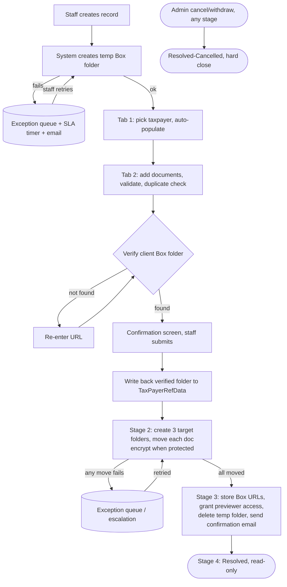
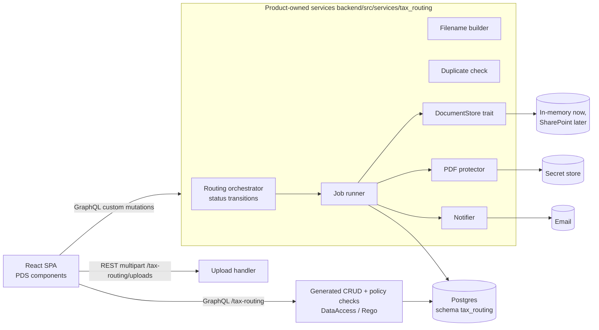
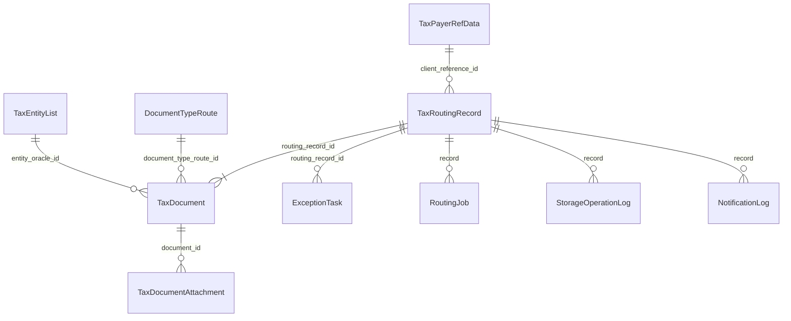

# Tax Document Routing — Frontend, Backend and Database Design

Status: **draft, revision 2**. Decisions recorded so far:

- **D1 decided:** two roles as RBAC, following the business spec — Tax Staff see only records assigned to them; Tax Admin see all. This **supersedes spec-2's "no read filtering"**, so spec-2 must be updated.
- **Storage:** Box is replaced by **SharePoint**, integration deferred. Build against a storage abstraction and an in-memory fake now.
- **D4, D5 (waits), D6 deferred** by the product owner. D2, D3 (batch size) and the rest remain open.

Sources read for this document:

- `TaxDocumentRouting_Platform_Agnostic_Spec_Final_1.docx` (business spec v1.0, May 2026) — cited as **[BS §n]**
- `docs/specs/spec-1-data-model.md`, `spec-2-roles-permissions.md`, `spec-5.4-taxpayer-details-tab.md` — cited as **[spec-1]**, **[spec-2]**, **[spec-5.4]**
- `.appfw/model/schemas/tax_routing/` (current model) and `frontend/` (still the CRM sample)
- PDS Health catalog: `app-framework/appfw_ui/pds_health/reference/catalog.json`

---

## 1. Business understanding

**Who and why.** The tax department of a physician-management organisation files tax documents for *owner doctors*: physicians who also own partnerships, corporations and personal corporations. Documents arrive individually or in batches (K-1s can be 3,000+) and must land in the right Box folder, for the right client, every time [BS §1.1, §3.4].

**Unit of work.** One *Tax Document Routing record* = one routing event for one client, containing one or more documents [BS §1.3].

**Roles** [BS §2]: Tax Staff (`tax_staff`) create and process records; Tax Admin (`tax_admin`) additionally see everything, cancel/withdraw records, and maintain reference data.

### 1.1 End-to-end flow

Only Stage 1 involves a person. Stages 2–4 are automatic once the confirmation screen is submitted [BS §4, §10].

### 1.2 Document routing (reconstructed from BS §3.4 — the table is garbled in the source; confirm)

| Document type | External folder | Internal folder | Writes internal? |
|---|---|---|---|
| K-1 / Draft K-1 (Preliminary K-1) | K-1s | 4. Tax Documents | Yes |
| Tax Return (1040/1065/1120) | Tax Returns | 7. Tax Returns | Yes |
| Income Statement | Loan Assistance | Loan Assistance | Yes |
| Balance Sheet | Loan Assistance | Loan Assistance | Yes |
| S-Corp Election | Signature Requests | — | External only |
| S-Corp (`IsDocumentType_SCorp`, added Jan 2025) | Signature Requests | — | External only |
| Form 8308 | K-1s | — | External only |
| Extensions | Tax Returns | — | External only |

### 1.3 Box destinations per document [BS §6.2, §14]

| Destination | Property in spec | Encrypted when password-protected? |
|---|---|---|
| Internal Quick View | `InternalSubFolderID2` | **Never** |
| External Client Copy | `ExternalSubFolderID2` | Yes |
| Internal Client Copy | `InternalSubFolderID3` | Yes |

External-only types skip both internal destinations.

### 1.4 Filename convention [BS §14.11]

`LastName, FirstName - {Year} {DocType}.pdf` for personal documents, and `LastName, FirstName - {EntityRef} {EntityName} - {Year} {DocType}.pdf` for entity documents. Protected files get ` (SECURED)` / ` (UNSECURED)` suffix variants [BS §6.4]. The filename is the only metadata Box holds, so this must be a single, unit-tested function.

---

## 2. What already exists

| Area | State |
|---|---|
| Backend | Generated from the App Framework. `/tax-routing` GraphQL is live with 6 entities: `TaxRoutingRecord`, `TaxDocument`, `DocumentTypeRoute`, `TaxPayerRefData`, `TaxEntityList`, `ExceptionTask` (+ audit tables for those marked `audited`). |
| Database | Postgres, schema `tax_routing`, 10 tables, empty. No seed data. No migration files for `tax_routing` (only `crm` has them). |
| RBAC | **None yet** for `tax_routing` (spec-2 is written but the `.rego` files do not exist). |
| Custom logic | None. No Box client, no PDF handling, no email, no job runner, no upload endpoint. I found no Box client anywhere in `appfw_runtime`. |
| Frontend | CRM sample (Accounts/Pipeline/Activities/Dashboard). Shell, auth and tenant plumbing are reusable; every feature screen must be replaced. |

---

## 3. Conflicts and open decisions (need answers before build)

| # | Issue | Source A | Source B | Recommendation |
|---|---|---|---|---|
| D1 ✅ **Decided** | **Who sees which records** | BS §2.3, BR-19/20: Standard Users see only records assigned to them; Admin sees all plus an *Assigned To* column | spec-2 (Product Owner, 2026-09-24): explicitly **no** per-record read filtering; all staff see all records | **Decision: follow the business spec.** Two roles as RBAC. Tax Staff: read/act only on records where `assigned_operator` is themselves, enforced in the query filter (Rego `allow` + row `filter`), not the UI. Tax Admin: all records, *Assigned To* column, reassign, cancel. spec-2's Goals, Options Considered and Decision Provenance rows on read visibility must be rewritten; its `retry_failed_step` owner-or-admin rule stays and now matches the read scope. |
| D2 | **Cancel / withdraw** | BS §9.1: admin-only, modal with Resolution Status + mandatory Comments, irreversible, closes all sub-records | spec-1/spec-2 never model it (no `resolution_status`, no comment, no admin-only cancel policy) | Add it (section 5.2, 6.4). Not optional — it is a stated business rule (BR-17/18). |
| D3 | **Entity filename token** | BS §14.11 (first copy): `EntityTypeNumber`, inserted **only for Partnership** | BS §14.11 (second copy): `OracleID`, for all entity documents | Use `OracleID`, for every entity-typed document. Confirm; the first copy looks stale. |
| D4 ⏸ Deferred | **The 5-minute waits** | BS §6.2, §7.2: two 5-min timers plus a 5-min wait after every move and every collaborator call | — | These are Pega async artefacts. Storage API calls complete synchronously. Build as a configurable per-step `run_after` delay defaulting to 0, and ask the owner whether folder provisioning genuinely needs them. |
| D3/D5 ⏸ Open | **Batch size** | BS §3.4 note: "Batches of 3,000+ possible" for K-1s | — | Undefined whether that is 3,000 documents in one record or 3,000 records. Drives UI (virtualised grid, bulk upload), job design and storage rate limits. **Must be answered.** |
| D6 ⏸ Deferred | **Bulk "Resolve Selected Cases"** | BS §2.2, §12.2 | Not defined anywhere | Ask what "resolve" means for an in-flight record. Proposed: only allowed for records in `exception` that the user can retry, running retry in bulk. |
| D7 | **"Change Stage" action for all users** | BS §12.4 | Contradicts "all stage transitions are automatic" [BS §10] | Proposed: drop it, or restrict to Tax Admin as "retry from step". A free stage change would let a user skip storage verification or encryption. |
| D8 | **Collaborator access vs Notification Flag** | BS §7.2: previewer access is granted always | BS §13.2: only the *email* is gated by the flag | Keep as specified (access always, email gated). Confirm the client should get folder access even with notifications off. |
| D9 | **Encryption failure** | BS §6.4 security note: the legacy handler does not mark the doc failed, so an unprotected file could reach Box | — | Design rule: **fail closed**. Any encryption error marks the document failed and raises an exception. Never upload the plain file. |
| D10 | **Secrets** | BS §3.5/§6.4: RW password plain text; master password only Base64 | spec-5.4: encrypted at rest, never returned to browser | Follow spec-5.4. Master password goes to a secret store, not Base64 config. |
| D11 ⏸ Deferred | **Storage platform: Box → SharePoint** | BS §14 is written entirely against Box | Product owner: integrate with SharePoint later | Design to a neutral `DocumentStore` interface (section 4.3) and build only the in-memory fake now. Box-specific names in the model become storage-neutral (section 5.2). SharePoint specifics (Graph API, site/library/drive ids, app registration, permission model for the `previewer`-style access in BS §7.2, folder/file-name limits, throttling) are gathered when that work starts. |
| D12 | **Wrong field name** | BS §3.5: legacy `FolderName` actually holds the external folder ID | spec-1 already renames it `external_folder_id` | Agreed. But `TaxRoutingRecord.folder_name` in the current model must be renamed `external_folder_id` too, or documented as "display name" if BS §3.2 "Folder Name" is meant as a label. Confirm. |

---

## 4. Backend architecture

### 4.1 Shape

Keep the framework's generated layer for CRUD/GraphQL/RBAC/audit, and add a **product-owned workflow layer** beside it. Do not put workflow logic in generated files.

Where things live (matching the CRM example's pattern noted in spec-1): custom method declaration in the entity YAML, generated stub, human-owned service in `backend/src/services/`, handler in `backend/src/handlers/tax_routing/`. Run `scripts/appfw product explain ownership <path>` before touching any generated-looking file.

### 4.2 Lifecycle as status + jobs (consistent with spec-1)

spec-1 deliberately uses a `status` enum and `ExceptionTask`, not a workflow engine. Keep that. Add one thing the Pega spec got from its engine and spec-1 omits: a **durable job table**, so the waits and retries survive restarts.

Status values (extend spec-1's enum with one value):

| Status | Meaning | Next |
|---|---|---|
| `creating_temp_folder` *(new)* | Record created; storage temp-folder call pending | `collecting_info` or `exception` |
| `collecting_info` | Stage 1: staff filling Tab 1/Tab 2 / confirming | `processing` |
| `processing` | Stage 2 running | `cleaning_up` or `exception` |
| `cleaning_up` | Stage 3 running | `resolved` or `exception` |
| `resolved` | Stage 4, read-only | — |
| `cancelled` | Hard close by admin | — |
| `exception` | An `ExceptionTask` is open | back to the failed step on retry |

A record in `exception` keeps `failed_step` on the task; retry re-enters that step, then continues automatically.

**Job runner.** A `routing_jobs` row per pending automated step, claimed with `SELECT … FOR UPDATE SKIP LOCKED`, run by an in-process tokio worker started next to the HTTP server. Each step is **idempotent** (check storage state before creating/moving) because a crash mid-step will re-run it. Steps: `create_temp_folder`, `verify_client_folder`, `create_target_folders`, `process_document` (one job per document, so 3,000 documents parallelise and retry independently), `finalize` (store URLs, collaborator access, delete temp folder, email). On error: attempts counter → backoff → after N attempts open an `ExceptionTask`.

Note: the framework's sync worker shell is for SaaS sync and refuses to run in the HTTP process, and says execution "remains disabled"; do not reuse it for this.

### 4.3 Document storage integration (SharePoint later)

- Define a `DocumentStore` trait covering the operations in BS §14, described neutrally: authenticate, create folder, folder exists / get info, upload file, read file, move file, delete file, delete folder, grant read-only access.
- Now: `InMemoryDocumentStore` only (dev, test, demo). Later: `SharePointDocumentStore`, selected by config. Nothing outside the trait may mention Box or SharePoint.
- Business terms stay: temp/staging folder, Internal Quick View, External Client Copy, Internal Client Copy. Only their backing store changes.
- Rate limiting and retry with backoff live in the store implementation, not in step code.
- Every storage call writes a row to `storage_operation_log` (record, document, operation, request id, outcome, duration). This is the audit evidence BS §1.4 asks for and the first thing support will need.

### 4.4 PDF protection

- In-memory only, no temp files [BS §6.4]. Use a Rust PDF library able to apply standard security handler encryption with user + owner passwords and a **print-only** permission set (all other permissions off [BS §6.4 table]). Prove this against a spike before committing to a crate.
- Two passwords: per-client Read/Write password (user password), and the master password (owner password, from the secret store).
- Only External Client Copy and Internal Client Copy receive the encrypted file; Internal Quick View always gets the original [BS §6.4].
- Fail closed (D9). Add a test that a forced encryption error results in a failed document and **zero** uploads.

### 4.5 API surface

| Need | Mechanism |
|---|---|
| Entity list/read/update, reference tables | Generated GraphQL |
| Taxpayer search (typeahead, paged) | Custom query `list_active_taxpayers(search, page)` per spec-1 — server-side filter, never a full scan |
| Entity search | `list_active_entities(search, page)`; `find_entity_by_oracle_id` |
| Select taxpayer for a record | Custom mutation `apply_taxpayer(record_id, taxpayer_id)` — copies the denormalised fields **server-side** so the password never reaches the browser |
| Add / validate / remove document | Custom mutations; duplicate check runs server-side |
| PDF upload | REST multipart `/tax-routing/uploads` (GraphQL is a poor fit for large binaries). Streams to the temp storage folder, returns file id + URL |
| Confirm and submit | `submit_record(record_id)` — verifies client folder, writes back, enqueues Stage 2 |
| Re-enter URL | `update_client_folder(record_id, folder_ref)` then re-verify |
| Retry exception | `retry_failed_step(exception_id)` — owner-or-admin check in Rust per spec-2 |
| Cancel | `cancel_record(record_id, resolution_status, comments)` — admin only |
| Bulk retry | `retry_exceptions(ids[])` (D6) |

### 4.6 Access control (business spec two-role RBAC)

Two roles, `tax_staff` and `tax_admin`, in `rbac/*.rego` (spec-2's role names are kept; its read-visibility rule is replaced per D1):

| Capability | `tax_staff` | `tax_admin` |
|---|---|---|
| Create record | Yes (becomes `assigned_operator`) | Yes |
| Read/act on records | Only where `assigned_operator` = self (row filter in Rego) | All |
| See *Assigned To* / reassign | No | Yes |
| Exception queue | Yes, per BS §2.2 (open question: whole queue or own records only — BS §5.3 calls it "shared … visible to all staff", which conflicts with own-records scoping; propose whole queue shows failed-step summary only, retry limited to owner/admin) | Yes |
| Cancel/withdraw | No | Yes |
| Reference-table writes | No | Yes |

Also extend with what spec-2 missed: `cancel_record` admin-only (BR-17), all entity writes on `TaxPayerRefData` / `TaxEntityList` / `DocumentTypeRoute` admin-only, and a single policy switch for D1. Local dev auth already supports `Authorization: Bearer appfw-local:user=<n>;tenant=<t>;roles=tax_staff` (see `CLAUDE.md`), so every rule can be tested without Okta. Okta group → role mapping remains an open deployment item (spec-2).

### 4.7 Notifications

Two emails only [BS §13]: **Exception** (internal, on any Stage 1/2 failure; includes case link and folder link) and **Final Confirmation** (to client PDS + personal email, only when `notification_flag` is true and the temp folder is deleted). No reminder or SLA-breach emails exist in the business spec; do not add any. Send through a `Notifier` trait with an SMTP implementation and a log-only dev implementation. Store every send in `notification_log` so "did the client get the email?" is answerable and a retry cannot double-send.

### 4.8 Cross-cutting

- **Idempotency** on every mutation and job step.
- **Concurrency:** the model already uses the `concurrency` facet; surface save-conflicts in the UI.
- **Observability:** the runtime already emits request and correlation ids; carry the correlation id into jobs and the storage log.
- **Config:** Storage credentials, folder ids, email, delays and retry limits via env/config, never in code.

---

## 5. Database design

Postgres, schema `tax_routing`. Entities are defined in `.appfw/model/…/entity_types/*.yaml` and generated; do not hand-edit the generated SQL. Changes below are **model changes** followed by `product generate`.

### 5.1 ER overview

### 5.2 Changes to existing entities

**`TaxRoutingRecord`** — add:

| Field | Type | Why |
|---|---|---|
| `temp_folder_id` | text | Storage staging folder [BS §5.2, §14]; storage-neutral name |
| `client_folder_verified` | bool | `ClientFolderExist` [BS §5.6] |
| `quick_view_folder_id`, `external_folder_id_resolved`, `internal_copy_folder_id` | text | The three provisioned target folders [BS §14] |
| `is_temp_folder_empty` | bool | Stage 3 result [BS §11] |
| `resolution_status` | enum (`completed`, `cancelled`, `withdrawn`, …values to confirm) | Cancel form [BS §9.1] |
| `resolution_comments` | text | Written permanently to audit trail |
| `resolved_at`, `cancelled_by` | timestamp, text | Terminal-state evidence |
| `is_escalated` | bool | Stage 2 reconciliation [BS §6.3] |
| `read_write_password` | keep, but store **encrypted** and exclude from every GraphQL selection; expose `password_on_file: bool` instead | spec-5.4. Today the model only sets `audit.redact`, which does not stop the API returning it — verify and close this before any real data. |

`status` enum: add `creating_temp_folder`. Rename per D12.

**`TaxDocument`** — add `storage_file_id`, `storage_file_url` (replaces `box_file_url`), `processing_status` (`pending`, `moved`, `failed`), `failure_reason`, `final_file_name`, `is_password_protected` retained, `is_entity_partnership` derived not stored. Model K-1 / Form 8308 / amended attachments as child rows (`TaxDocumentAttachment`: `document_id`, `kind`, `file_name`, `box_file_id`) instead of the three "file list" columns, so each file can be moved and retried individually.

**`ExceptionTask`** — add `retry_count`, `last_error`, `is_escalated`. Keep spec-1's fields.

**`DocumentTypeRoute`** — add `is_external_only` (bool) rather than inferring it from a null internal folder or the string "External only"; seed with section 1.2.

**Security finding (verified 2026-09-28): the client password is readable in clear.** With the RBAC
policies in place, any Tax Staff user can still select `read_write_password` on `TaxPayerRefData`
through GraphQL and receive the plaintext value. A row policy cannot hide a column, and the
framework has no field-level read protection (`meta.audit.redact` affects audit payloads only; the
"secret" fragment is a plain string). Options for the product owner:

| Option | How | Trade-off |
|---|---|---|
| A. Encrypt at rest (recommended first step) | Store an authenticated-encryption ciphertext (`enc:v1:...`) using a key from the secret store; only the PDF service decrypts. GraphQL then returns ciphertext, and the UI uses a `password_on_file` flag. | Small change; leaks only ciphertext to staff. Key management becomes a hard requirement. |
| B. Separate service-only entity | Move the secret to `TaxPayerCredential` with no staff policy; the routing service reads it as a service principal. | Strongest (staff cannot select it at all) but needs a service principal and one more entity. |
| C. Both | A now, B when the PDF service exists. | Most work, best posture. |

Also open: Rego cannot stop a staff `update` from changing `assigned_operator` (reassignment is
admin-only), so the routing service must enforce it; and `tax_admin` alone cannot read `*_audit`
entities, so map Tax Admins to both `tax_admin` and `admin` until the framework gate is understood.
`scripts/smoke/rbac_smoke.py` records the first two as KNOWN GAP lines.

### 5.3 New entities

| Entity | Purpose | Key fields |
|---|---|---|
| `RoutingJob` | Durable work queue | `record_id`, `document_id?`, `step`, `status`, `attempts`, `run_after`, `locked_by`, `last_error` |
| `StorageOperationLog` | Storage audit trail | `record_id`, `document_id?`, `operation`, `provider_request_id`, `outcome`, `duration_ms` |
| `NotificationLog` | Emails sent | `record_id`, `kind` (exception/final), `recipients`, `sent_at`, `outcome` |
| `TaxDocumentAttachment` | K-1 / 8308 / amended files | see above |

### 5.4 Indexes and constraints

- `TaxRoutingRecord`: `(status)`, `(assigned_operator, status)`, `(client_reference_id)`, `(created_at desc)`.
- `TaxDocument`: `(routing_record_id)`, unique-ish duplicate guard on `(routing_record_id, document_type_route_id, document_year, document_name)` — enforce as a **warning**, not a hard constraint, because BR-05 allows saving a duplicate after confirmation.
- `RoutingJob`: partial index `(run_after) WHERE status = 'pending'`.
- `TaxPayerRefData`: trigram/`lower(full_name)` index for typeahead; `is_active` filter.
- `TaxEntityList`: unique `oracle_id`.

### 5.5 Migrations and seed

- Generate migrations for `tax_routing` (none exist today; I applied the generated `tables.pg.sql` by hand to the dev DB).
- Seed: the 8 `DocumentTypeRoute` rows above, a handful of `TaxPayerRefData` and `TaxEntityList` rows for development, and the two demo users/roles.
- **Windows note:** `scripts/appfw` is bash-only and `product migrate` fails from the CLI on Windows. Run migrations from WSL/Git Bash-native tooling or in CI; do not rely on my manual workaround.

### 5.6 Volume

Reference tables are read heavily and written rarely; the documents table is the growth driver (D5). Partition or archive `StorageOperationLog` by month if 3,000-document batches are routine.

---

## 6. Frontend design

React 18.3 + Vite + `react-router` 7 (same versions as Project Governance), built on `@appfw/pds-health-components` and PDS tokens. Layout: `src/app` (shell, routes, providers), `src/components` (shared presentational pieces), `src/features/{dashboard,routing,records,exceptions,admin,shared}` (screens; `shared` holds types, config, mock data/services and the business-rule utils with unit tests), `src/lib`, `src/test` (PDS rule tests). PDS components are imported by family subpath, never from the package root outside `main.tsx`. **Rule from spec-5.4: no product-local field wrappers or bespoke table chrome; use the catalog components.** Access decisions come from backend policy responses, never client-side role strings (ADR 0010).

### 6.1 Information architecture

| Route | Screen | Audience |
|---|---|---|
| `/` | Dashboard: Work I Need To Do, Recent Cases, Exception summary | All |
| `/records/new` | Start a record (creates temp folder, then opens the workspace) | All |
| `/records/:id` | Case workspace (below) | All |
| `/exceptions` | Exception queue | All |
| `/admin/taxpayers` | Taxpayer reference maintenance | Admin |
| `/admin/entities` | Entity reference maintenance | Admin |
| `/admin/document-routes` | Document-type → folder routing | Admin |

Left navigation trimmed from the CRM's five workflows to these; keep the shell, breadcrumbs, command search, theme toggle and auth/tenant bar.

### 6.2 Screens

**Dashboard.** `PageHeader` + `KpiTile` row (Open, In processing, In exception, Completed this week) → **Work I Need To Do** grid → **Recent Cases**. Grid columns per BS §12.2/12.3: Record ID (link), Task, Status, Client Name, PDS Email, Personal Email, Created, Last Updated, plus *Assigned To* when D1 says admin-only or the user is admin. Checkbox column and **Resolve Selected** only if D6 is confirmed. Uses the `generated-entity-workspace` recipe (`DataGrid`, `DataGridToolbar`, filter, column chooser, density, `DataGridPagination`).

**Case workspace `/records/:id`.** `PageHeader` (record id, client, status badge) with a `ProcessStepper` for the four stages, and a case-action `MenuButton` (Edit details; **Cancel/Withdraw** only when the backend grants it). Body is `Tabs`:

1. **Taxpayer Details** (spec-5.4). `FormLayout`/`FieldGroup`; `LookupSelect` for taxpayer search with server-side typeahead; selecting a result calls `apply_taxpayer` once and all nine read-only fields fill together. Editable: Additional Email, Send Notification. Read/Write Password is a "Password on file" status indicator, never a value.
2. **Documents.** A grid of document rows with an add/edit `Drawer` (Document Type, Year, Name, Entity Type → Entity Name lookup → Oracle ID, Password Protected, PDF `FileUpload`; K-1 attachment list only for K-1/Draft K-1; Form 8308 list only for 8308). `ValidationSummary` for rules in BS §5.5a; duplicate warning via `ConfirmDialog` (BR-05). Virtualised if D5 says 3,000 rows.
3. **Confirmation.** Read-only summary; **Submit** is the last human action. If folder verification fails, an `InlineAlert` and a **Re-enter URL** panel appear in place (BR-04).
4. **Processing.** Per-document status list with the three storage destinations, live-refreshing; failures show a **Retry** action (owner/admin per spec-2).
5. **History.** Audit timeline (status changes, storage operations, emails, cancellation comment).

After Stage 4 the workspace is read-only (`Banner` "Resolved").

**Exception queue.** `DataGrid` of open `ExceptionTask`s with failed step, reason, age (SLA), assignee; row action **Process / Retry**; empty state via `EmptyState`.

**Cancel dialog.** `Dialog` + `ConfirmDialog` pattern from the `governed-action` recipe: required Resolution Status `SelectField`, required Comments `TextArea`, plain-language irreversibility warning, `ActionAudit` feedback. Hidden unless the backend authorises it.

**Admin reference screens.** Standard generated-entity list + form; taxpayer form omits the password value.

### 6.3 Component map

| Need | PDS component |
|---|---|
| Shell, header, breadcrumbs | `AppShell`, `PageHeader`, `Breadcrumbs`, `CommandPalette` |
| Grids | `DataGrid` family |
| KPIs | `KpiTile`, `MetricTrend` |
| Stage progress | `ProcessStepper`, `ProcessProgress` |
| Forms | `FormLayout`, `FieldGroup`, `TextField`, `ComboboxField` (client search and, via the `SingleSelectField` wrapper in `components/ui.tsx`, every single-choice field), `CheckboxField`, `SwitchField`, `TextArea`, `FileUpload`, `ValidationSummary`. `SelectField` is not used: in PDS 0.12.0 its picker renders permanently open in browsers with `appearance: base-select` (same finding and workaround as Project Governance). |
| Overlays | `Dialog`, `Drawer`, `ConfirmDialog`, `Tooltip` |
| Feedback | `InlineAlert`, `Banner`, `ToastRegion`, `EmptyState`, `Skeleton`, `ForbiddenState`, `ErrorState`, `LoadingState` |
| History | Timeline family (`timeline.tsx`) |

Before building each screen, read the component's real API in `appfw_ui/pds_health/components/src` and its live states in the catalog (as spec-5.4 instructs).

### 6.4 Frontend data layer

Reuse `lib/appfwClient.ts`, `authContext.ts`, `tenantContext.ts`. Add a typed `taxRoutingApi` module (GraphQL + the upload endpoint), a small polling hook for the Processing tab (status is server-driven), and a `usePermission` helper that reads the backend's authorisation result (e.g. `can_cancel`, `can_retry`) rather than roles. Regenerate `src/generated/appfw-ui-contract` from the model.

### 6.5 Accessibility and quality

Reuse the existing Playwright + axe setup (`test:a11y`). Read-only fields must not be editable through keyboard or DOM tampering (spec-5.4 acceptance). Never colour-only status: pair every status badge with text/icon.

---

## 7. Security summary

- RW password: encrypted at rest, server-side only, never in any API response, audit-redacted, security sign-off before release (spec-5.4).
- Master password: secret store, rotated, restricted.
- Storage tokens (SharePoint later) and email credentials: environment/secret store; never logged.
- PII (names, emails): audit and log redaction policy to confirm.
- Authorisation enforced in `DataAccess`/Rego and Rust services; the UI only reflects it.
- Local-auth bypass is `ENV_NAME=local` only; real Okta group mapping is required before any non-PoC deployment.
- Do not put real client data in the dev database, and remember the dev DB currently lives inside another project's Postgres container.

---

## 8. Delivery plan

| Phase | Outcome | Depends on |
|---|---|---|
| 0. Answers | Decisions D1–D12, especially D1, D2, D5 | Product owner |
| 1. Foundation | Model changes, regenerate, migrations + seed, RBAC (`.rego`) + tests, remove CRM navigation | Phase 0 |
| 2. Stage 1 vertical slice | Create record, temp folder (in-memory store), Tab 1 typeahead + `apply_taxpayer`, Tab 2 documents + validation + duplicate check + upload, confirmation | Phase 1 |
| 3. Automation | Job runner, Stage 2 moves, PDF protection, Stage 3 finalise, emails | Phase 2 (real SharePoint store is a separate later phase, D11) |
| 4. Operations | Exception queue + retry, cancel, dashboards, admin reference screens, history timeline | Phase 3 |
| 5. Hardening | Batch performance (D5), security review, a11y, e2e tests, Windows/CI tooling fix, deployment config | Phase 4 |

Phase 2 is a demoable vertical slice and should be the first thing built after decisions.

## 9. Verification

Per repo convention: `scripts/appfw product validate --json`, `product generate` and `generate --check --json`, `cargo build`, `product test`, `cargo test -p rego_test`, frontend `npm run test:frontend`. Add specific tests for: password absent from API responses, filename builder (personal and entity, secured/unsecured), fail-closed encryption, routing table (external-only types write no internal copy), idempotent job replay, non-owner retry denied, and admin-only cancel.
